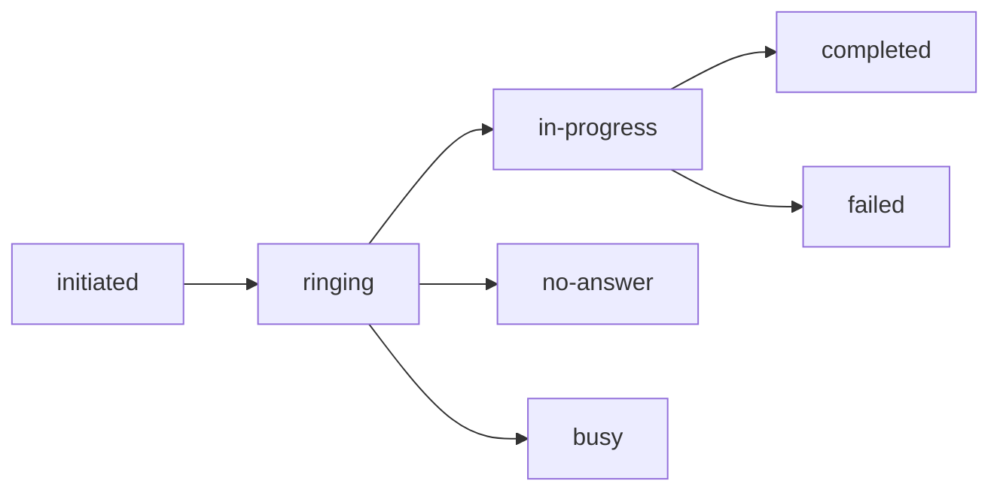

## Overview

IRISX provides enterprise-grade voice calling capabilities powered by FreeSWITCH with intelligent carrier routing, IVR menus, call recording, and real-time analytics.

## Call Lifecycle

Every call in IRISX goes through several states:



### Call States

<AccordionGroup>
  <Accordion title="initiated">
    Call request received and queued for processing. Carrier selected via LCR.
  </Accordion>
  <Accordion title="ringing">
    Call is ringing at the destination. Waiting for answer or timeout.
  </Accordion>
  <Accordion title="in-progress">
    Call answered and audio streaming. Billing started.
  </Accordion>
  <Accordion title="completed">
    Call ended normally. Final duration and cost calculated.
  </Accordion>
  <Accordion title="no-answer">
    Destination didn't answer within timeout period (default 60s).
  </Accordion>
  <Accordion title="busy">
    Destination returned busy signal.
  </Accordion>
  <Accordion title="failed">
    Call failed due to network error, invalid number, or carrier issue.
  </Accordion>
  <Accordion title="canceled">
    Call canceled before answer (by caller or system).
  </Accordion>
</AccordionGroup>

## Creating Calls

### Basic Outbound Call

```javascript
const call = await irisx.calls.create({
  to: '+15551234567',
  from: '+15559876543',
  webhook_url: 'https://yourapp.com/webhooks/calls'
});

console.log(`Call UUID: ${call.uuid}`);
```

### With Recording

```javascript
const call = await irisx.calls.create({
  to: '+15551234567',
  from: '+15559876543',
  record: true,  // Enable call recording
  webhook_url: 'https://yourapp.com/webhooks/calls'
});
```

### With Timeout

```javascript
const call = await irisx.calls.create({
  to: '+15551234567',
  from: '+15559876543',
  timeout: 30,  // Ring for 30 seconds
  webhook_url: 'https://yourapp.com/webhooks/calls'
});
```

### With Metadata

```javascript
const call = await irisx.calls.create({
  to: '+15551234567',
  from: '+15559876543',
  metadata: {
    customer_id: 'cust_12345',
    order_id: 'order_67890',
    campaign: 'summer-sale'
  },
  webhook_url: 'https://yourapp.com/webhooks/calls'
});
```

## Intelligent Routing

IRISX automatically selects the best carrier for each call using **LCR (Least Cost Routing)**.

### How LCR Works

1. **Destination Analysis:** Parse destination number (country, area code)
2. **Carrier Lookup:** Find all carriers serving that destination
3. **Cost Comparison:** Compare rates for all available carriers
4. **Quality Check:** Exclude carriers with poor health scores
5. **Selection:** Choose lowest-cost carrier with good health
6. **Failover:** Automatically retry with next carrier if primary fails

### Carrier Failover

If a call fails with the primary carrier, IRISX automatically retries with the next-best carrier:

```
Attempt 1: Carrier A (lowest cost) → Failed
Attempt 2: Carrier B (second lowest) → Failed
Attempt 3: Carrier C (third lowest) → Success
```

<Info>
  Failover attempts are transparent - you get one webhook event with the final result.
</Info>

## Call Direction

IRISX supports both inbound and outbound calls:

### Outbound Calls

Initiated by your application via API:

```javascript
// You control: to, from, routing
const call = await irisx.calls.create({
  to: '+15551234567',
  from: '+15559876543'
});
```

### Inbound Calls

Received on your IRISX phone numbers:

```javascript
// Configure webhook on phone number
await irisx.phoneNumbers.update(phoneNumberId, {
  webhook_url: 'https://yourapp.com/webhooks/inbound'
});
```

Your webhook receives:
```json
{
  "event": "call.initiated",
  "data": {
    "uuid": "...",
    "direction": "inbound",
    "to": "+15559876543",
    "from": "+15551234567",
    "caller_name": "John Doe"
  }
}
```

## Call Recording

Enable recording for compliance, quality assurance, or training:

```javascript
const call = await irisx.calls.create({
  to: '+15551234567',
  from: '+15559876543',
  record: true
});
```

### Accessing Recordings

After call completes, `recording_url` is available:

```javascript
// Get call details
const call = await irisx.calls.get(callUuid);

if (call.recording_url) {
  console.log('Recording:', call.recording_url);
  // URL expires after 7 days - download if needed
}
```

### Recording Settings

Configure recording settings at the tenant level:

- **Auto-record:** Record all calls by default
- **Format:** MP3 or WAV
- **Storage:** S3 bucket (7-90 day retention)
- **Encryption:** At-rest encryption (AES-256)

## Call Duration & Billing

### Duration Calculation

- **Bill start:** When call is answered (state: `in-progress`)
- **Bill end:** When call disconnects (state: `completed`)
- **Rounding:** Rounded up to nearest second

### Cost Calculation

```
Cost = (Duration in minutes) × (Rate per minute)
```

Example:
- Duration: 125 seconds = 2.083 minutes
- Rate: $0.015/min
- Cost: 2.083 × $0.015 = $0.031

<Note>
  Partial minutes are billed. A 61-second call is charged for 1.017 minutes.
</Note>

### Free Seconds

Some carriers include free seconds (first 6 seconds free):

```
Billable Duration = max(0, Actual Duration - Free Seconds)
```

## Call Limits

### Rate Limits

- **API Calls:** 10 requests/minute
- **Concurrent Calls:** Varies by plan (default: 10)
- **CPS (Calls Per Second):** Varies by plan (default: 2)

### Geographic Restrictions

Some destinations may be restricted:

- **Premium numbers:** May require approval
- **International:** Check coverage map
- **Satellite phones:** Higher rates apply

## Call Quality

IRISX monitors call quality metrics:

- **ASR (Answer Seizure Ratio):** % of calls answered
- **ACD (Average Call Duration):** Mean call length
- **PDD (Post Dial Delay):** Time to ring
- **MOS (Mean Opinion Score):** Voice quality (1-5)

View quality metrics in your dashboard.

## Error Handling

Common call errors:

| Error | Cause | Solution |
|-------|-------|----------|
| `invalid_number` | Malformed phone number | Use E.164 format (+1...) |
| `unallocated_number` | Number doesn't exist | Verify destination |
| `no_route` | No carrier available | Contact support |
| `insufficient_funds` | Low balance | Add credits |
| `rate_limited` | Too many requests | Slow down, add backoff |

## Best Practices

<CardGroup cols={2}>
  <Card title="Use E.164 Format" icon="phone">
    Always format numbers as `+[country][number]`
  </Card>
  <Card title="Set Webhooks" icon="webhook">
    Use webhooks for real-time call status updates
  </Card>
  <Card title="Handle Failures" icon="triangle-exclamation">
    Implement retry logic with exponential backoff
  </Card>
  <Card title="Monitor Quality" icon="chart-line">
    Track ASR and ACD in your dashboard
  </Card>
</CardGroup>

## Next Steps

<CardGroup cols={3}>
  <Card title="Making Calls Guide" icon="phone" href="/guides/making-calls">
    Learn advanced call features
  </Card>
  <Card title="IVR Menus" icon="phone-volume" href="/guides/ivr-menus">
    Build interactive voice menus
  </Card>
  <Card title="Call Recording" icon="microphone" href="/guides/call-recording">
    Record and manage call audio
  </Card>
</CardGroup>
