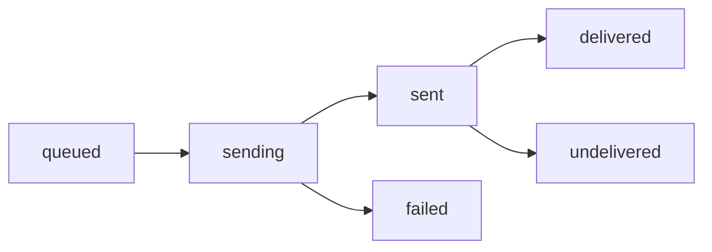

## Overview

IRISX provides reliable SMS and MMS messaging with delivery tracking, templates, scheduling, and opt-out management powered by Twilio and Telnyx.

## Message Lifecycle



### Message States

- **queued:** Message accepted and queued for sending
- **sending:** Being transmitted to carrier
- **sent:** Accepted by carrier network
- **delivered:** Confirmed delivered to recipient
- **failed:** Failed to send (invalid number, network error)
- **undelivered:** Sent but not delivered (phone off, out of coverage)

## Sending SMS

### Basic Message

```javascript
const message = await irisx.sms.send({
  to: '+15551234567',
  from: '+15559876543',
  body: 'Hello! This is your verification code: 123456'
});

console.log(`Message ID: ${message.id}`);
console.log(`Status: ${message.status}`);
```

### With Webhook

```javascript
const message = await irisx.sms.send({
  to: '+15551234567',
  from: '+15559876543',
  body: 'Your order #12345 has shipped!',
  webhook_url: 'https://yourapp.com/webhooks/sms'
});
```

### MMS with Media

```javascript
const message = await irisx.sms.send({
  to: '+15551234567',
  from: '+15559876543',
  body: 'Check out this image!',
  media_urls: [
    'https://example.com/images/photo.jpg',
    'https://example.com/images/photo2.jpg'
  ]
});
```

## Message Segments

SMS messages are divided into segments based on length:

| Encoding | Characters per Segment |
|----------|----------------------|
| GSM-7 | 160 characters |
| GSM-7 (multi-part) | 153 characters |
| Unicode | 70 characters |
| Unicode (multi-part) | 67 characters |

### Segment Calculation

```javascript
// Single segment (160 chars GSM-7)
'Hello! Your code is 123456' // 1 segment

// Multi-segment (over 160 chars)
'Long message...' // 2 segments = 2× cost

// Unicode (emojis force Unicode encoding)
'Hello 👋 Your code is 123456' // 1 segment (70 char limit)
```

<Info>
  Each segment is billed separately. A 320-character message = 3 segments = 3× cost.
</Info>

## Bulk Messaging

Send to multiple recipients:

```javascript
const result = await irisx.sms.sendBulk({
  from: '+15559876543',
  recipients: [
    { to: '+15551111111', body: 'Hello Alice!' },
    { to: '+15552222222', body: 'Hello Bob!' },
    { to: '+15553333333', body: 'Hello Carol!' }
  ]
});

console.log(`Sent: ${result.successful}`);
console.log(`Failed: ${result.failed}`);
```

## Message Templates

Create reusable templates:

```javascript
// Create template
const template = await irisx.sms.createTemplate({
  name: 'order_confirmation',
  body: 'Hi {{name}}, your order #{{order_id}} is confirmed!'
});

// Send using template
const message = await irisx.sms.sendTemplate({
  to: '+15551234567',
  from: '+15559876543',
  template_id: template.id,
  variables: {
    name: 'John',
    order_id: '12345'
  }
});
```

## Scheduled Messages

Schedule messages for future delivery:

```javascript
const scheduled = await irisx.sms.schedule({
  to: '+15551234567',
  from: '+15559876543',
  body: 'Reminder: Your appointment is tomorrow at 2pm',
  send_at: '2025-11-01T14:00:00Z'  // ISO 8601 format
});

// Cancel if needed
await irisx.sms.cancelScheduled(scheduled.id);
```

## Opt-Out Management

IRISX automatically handles STOP/START keywords:

### Automatic Handling

```
User sends: "STOP"
→ Added to opt-out list
→ Auto-reply: "You have been unsubscribed. Reply START to opt back in."

User sends: "START"
→ Removed from opt-out list
→ Auto-reply: "You are now subscribed. Reply STOP to opt out."
```

### Checking Opt-Out Status

```javascript
// Check before sending
const optOuts = await irisx.sms.getOptOuts();
const isOptedOut = optOuts.some(num => num === '+15551234567');

if (!isOptedOut) {
  await irisx.sms.send({ /* ... */ });
}
```

### Manual Opt-Out

```javascript
// Add to opt-out list
await irisx.sms.optOut({
  phone_number: '+15551234567',
  reason: 'customer_request'
});
```

## Delivery Tracking

Track message delivery via webhooks:

```javascript
// Webhook handler
app.post('/webhooks/sms', (req, res) => {
  const { event, data } = req.body;

  switch (event) {
    case 'sms.sent':
      console.log(`Message ${data.id} sent to carrier`);
      break;

    case 'sms.delivered':
      console.log(`Message ${data.id} delivered`);
      // Update database, trigger next action
      break;

    case 'sms.failed':
      console.error(`Message ${data.id} failed: ${data.error_message}`);
      // Retry with different number or notify user
      break;
  }

  res.status(200).send('OK');
});
```

## Inbound SMS

Receive messages on your numbers:

```javascript
// Configure webhook on phone number
await irisx.phoneNumbers.update(phoneNumberId, {
  sms_webhook_url: 'https://yourapp.com/webhooks/inbound-sms'
});

// Webhook receives
{
  "event": "sms.received",
  "data": {
    "id": 12345,
    "from": "+15551234567",
    "to": "+15559876543",
    "body": "Hello, I need support",
    "media_urls": [],
    "direction": "inbound",
    "created_at": "2025-10-30T18:00:00Z"
  }
}

// Auto-reply
await irisx.sms.send({
  to: inboundMessage.from,
  from: inboundMessage.to,
  body: 'Thanks for contacting us! A representative will respond shortly.'
});
```

## Pricing

SMS costs vary by destination:

- **US/Canada:** $0.0075/segment
- **UK:** $0.04/segment
- **International:** Varies by country

<Note>
  MMS messages cost more than SMS. Check pricing for your destinations.
</Note>

## Rate Limits

- **API Requests:** 100 requests/minute
- **Messages per Minute:** 200 (default)
- **Bulk Messages:** 1000 recipients per request

## Error Handling

Common SMS errors:

| Error | Cause | Solution |
|-------|-------|----------|
| `invalid_number` | Malformed phone number | Use E.164 format |
| `landline` | Destination is landline | SMS not supported on landlines |
| `opted_out` | Recipient opted out | Remove from list, don't retry |
| `invalid_content` | Message contains forbidden content | Review content policies |
| `rate_limited` | Too many messages | Implement rate limiting |

## Best Practices

<CardGroup cols={2}>
  <Card title="Keep It Short" icon="message">
    Aim for under 160 characters to avoid multi-segment charges
  </Card>
  <Card title="Include Opt-Out" icon="stop">
    Always provide opt-out instructions for marketing messages
  </Card>
  <Card title="Respect Timezones" icon="clock">
    Don't send messages late at night (avoid 9pm-8am)
  </Card>
  <Card title="Handle Failures" icon="rotate">
    Implement retry logic for failed messages
  </Card>
</CardGroup>

## Compliance

### TCPA (US)

- Get **prior express consent** before sending marketing messages
- Include **opt-out instructions** in every message
- Honor opt-out requests **immediately**
- Keep records of consent

### GDPR (EU)

- Obtain **explicit consent** before collecting phone numbers
- Provide **clear opt-out** mechanisms
- Allow users to **request data deletion**

### A2P 10DLC (US)

For high-volume messaging:
- Register your brand
- Register your campaign
- Get verified (3-5 business days)

<Warning>
  Unregistered high-volume senders may be blocked or throttled by carriers.
</Warning>

## Next Steps

<CardGroup cols={2}>
  <Card title="Sending SMS Guide" icon="paper-plane" href="/guides/sending-sms">
    Learn advanced SMS features
  </Card>
  <Card title="Webhooks" icon="webhook" href="/concepts/webhooks">
    Set up delivery notifications
  </Card>
</CardGroup>
