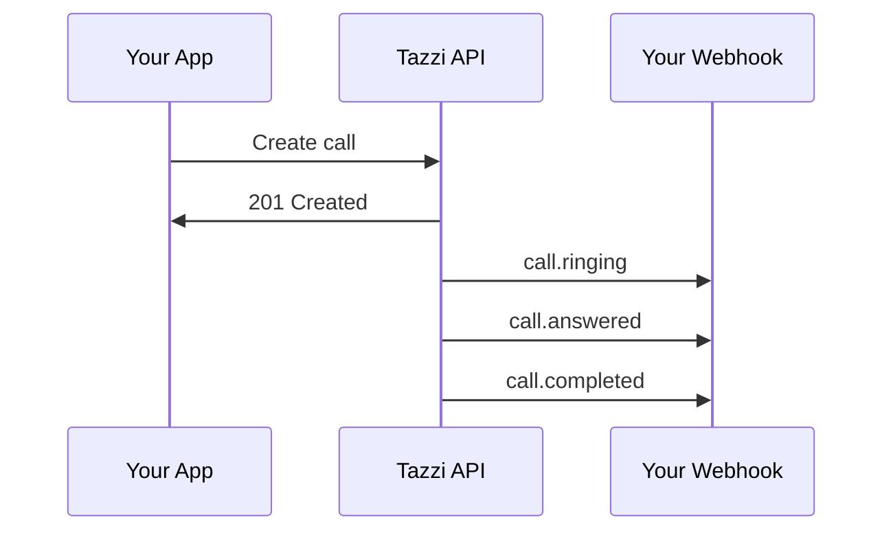

## Overview

Webhooks allow your application to receive real-time notifications when events occur in Tazzi (calls completed, messages delivered, etc.).

## How Webhooks Work



## Creating Webhooks

```javascript
const webhook = await tazzi.webhooks.create({
  url: 'https://yourapp.com/webhooks/tazzi',
  events: [
    'call.completed',
    'call.failed',
    'sms.delivered',
    'sms.failed'
  ],
  description: 'Production webhook'
});

console.log(`Webhook ID: ${webhook.id}`);
console.log(`Secret: ${webhook.secret}`);  // Save this!
```

## Available Events

### Call Events
- `call.initiated` - Call created
- `call.ringing` - Destination ringing
- `call.answered` - Call answered
- `call.completed` - Call ended normally
- `call.failed` - Call failed
- `call.no-answer` - No answer

### SMS Events
- `sms.queued` - Message queued
- `sms.sent` - Sent to carrier
- `sms.delivered` - Delivered to device
- `sms.failed` - Delivery failed
- `sms.received` - Inbound message

### Email Events
- `email.sent` - Email sent
- `email.delivered` - Delivered
- `email.opened` - Email opened
- `email.clicked` - Link clicked
- `email.bounced` - Hard/soft bounce
- `email.complained` - Spam complaint

## Webhook Payload

Every webhook has this structure:

```json
{
  "event": "call.completed",
  "timestamp": "2025-10-30T18:00:00Z",
  "data": {
    "uuid": "123e4567-e89b-12d3-a456-426614174000",
    "to": "+15551234567",
    "from": "+15559876543",
    "status": "completed",
    "duration": 125,
    "cost": 0.031,
    "recording_url": "https://s3.../recording.mp3"
  }
}
```

## Webhook Handler

### Express.js Example

```javascript
const express = require('express');
const crypto = require('crypto');

const app = express();
app.use(express.json());

app.post('/webhooks/tazzi', (req, res) => {
  // 1. Verify signature
  if (!verifySignature(req)) {
    return res.status(401).send('Invalid signature');
  }

  // 2. Handle event
  const { event, data } = req.body;

  switch (event) {
    case 'call.completed':
      handleCallCompleted(data);
      break;

    case 'sms.delivered':
      handleSMSDelivered(data);
      break;

    // ... more events
  }

  // 3. Return 200 quickly
  res.status(200).send('OK');

  // 4. Process async (don't block webhook)
  processEventAsync(event, data);
});

function verifySignature(req) {
  const signature = req.headers['x-tazzi-signature'];
  const webhookSecret = process.env.TAZZI_WEBHOOK_SECRET;

  const hmac = crypto
    .createHmac('sha256', webhookSecret)
    .update(JSON.stringify(req.body))
    .digest('hex');

  return signature === hmac;
}

app.listen(3000);
```

## Signature Verification

Tazzi signs every webhook with HMAC-SHA256:

```javascript
const crypto = require('crypto');

function verifyWebhook(payload, signature, secret) {
  const expectedSignature = crypto
    .createHmac('sha256', secret)
    .update(JSON.stringify(payload))
    .digest('hex');

  return crypto.timingSafeEqual(
    Buffer.from(signature),
    Buffer.from(expectedSignature)
  );
}

// Usage
const isValid = verifyWebhook(
  req.body,
  req.headers['x-tazzi-signature'],
  webhookSecret
);
```

<Warning>
  **Always verify signatures** to prevent spoofed requests!
</Warning>

## Best Practices

### 1. Return 200 Quickly

```javascript
app.post('/webhooks', async (req, res) => {
  // ✅ Good: Return immediately
  res.status(200).send('OK');

  // Then process async
  await processWebhook(req.body);
});
```

```javascript
app.post('/webhooks', async (req, res) => {
  // ❌ Bad: Processing blocks response
  await longRunningTask(req.body);
  res.status(200).send('OK');
});
```

### 2. Handle Duplicates

Webhooks may be delivered more than once:

```javascript
const processedEvents = new Set();

function handleWebhook(event) {
  const eventId = event.data.uuid + '-' + event.event;

  // Skip if already processed
  if (processedEvents.has(eventId)) {
    console.log('Duplicate event, skipping');
    return;
  }

  processedEvents.add(eventId);
  // Process event...
}
```

### 3. Implement Retry Logic

If your endpoint is down, Tazzi retries:
- Retry 1: After 1 minute
- Retry 2: After 5 minutes
- Retry 3: After 15 minutes
- Retry 4: After 1 hour
- Retry 5: After 6 hours

After 5 failed attempts, webhook is disabled.

### 4. Use HTTPS

```javascript
// ✅ Good
url: 'https://yourapp.com/webhooks'

// ❌ Bad (rejected in production)
url: 'http://yourapp.com/webhooks'
```

### 5. Handle All Events

```javascript
app.post('/webhooks', (req, res) => {
  const { event, data } = req.body;

  // Handle known events
  switch (event) {
    case 'call.completed':
      handleCallCompleted(data);
      break;

    // ... other cases

    default:
      // Log unknown events for debugging
      console.log('Unknown event:', event);
  }

  res.status(200).send('OK');
});
```

## Testing Webhooks

### Local Development

Use tunneling tools for local testing:

```bash
# Install ngrok
npm install -g ngrok

# Start tunnel
ngrok http 3000

# Use ngrok URL as webhook
https://abc123.ngrok.io/webhooks/tazzi
```

### Test Webhook

Test your webhook manually:

```javascript
const testWebhook = await tazzi.webhooks.test(webhookId);

if (testWebhook.success) {
  console.log('Webhook working!');
} else {
  console.error('Webhook failed:', testWebhook.error);
}
```

## Monitoring

View webhook delivery logs in dashboard:
- **Success Rate:** % of successful deliveries
- **Avg Response Time:** How fast your endpoint responds
- **Recent Failures:** Failed deliveries with error messages

## Troubleshooting

<AccordionGroup>
  <Accordion title="Webhooks not received">
    - Check endpoint is publicly accessible
    - Verify HTTPS (not HTTP)
    - Check firewall rules
    - Test with `curl` from external server
  </Accordion>

  <Accordion title="401/403 errors">
    - Ensure endpoint doesn't require authentication
    - Or whitelist Tazzi IP ranges
    - Check for CORS issues
  </Accordion>

  <Accordion title="Timeout errors">
    - Return 200 within 5 seconds
    - Process webhook async
    - Don't make external API calls before responding
  </Accordion>
</AccordionGroup>

## Next Steps

<CardGroup cols={2}>
  <Card title="Webhook Handlers Guide" icon="code" href="/guides/webhook-handlers">
    Build production-ready handlers
  </Card>
  <Card title="Security" icon="shield" href="/guides/webhook-security">
    Learn about signature verification
  </Card>
</CardGroup>
