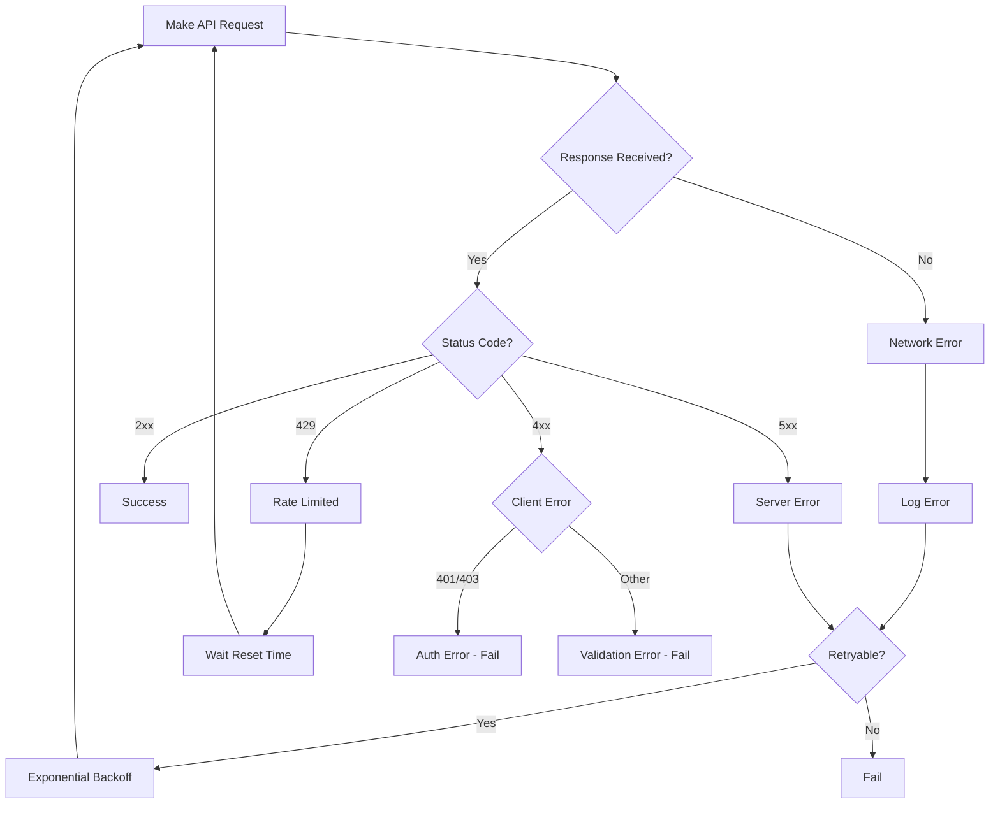

## Overview

Robust error handling is critical for production applications. Learn how to handle API errors, implement retry strategies, and build resilient integrations with IRISX.

<CardGroup cols={2}>
  <Card title="Status Codes" icon="code" href="#http-status-codes">
    Understand API response codes
  </Card>
  <Card title="Error Format" icon="file-code" href="#error-response-format">
    Parse and handle error responses
  </Card>
  <Card title="Retry Logic" icon="rotate" href="#retry-strategies">
    Implement exponential backoff
  </Card>
  <Card title="Rate Limits" icon="gauge-high" href="#rate-limiting">
    Handle rate limit responses
  </Card>
</CardGroup>

## HTTP Status Codes

IRISX uses standard HTTP status codes to indicate success or failure.

### Success Codes (2xx)

<ResponseField name="200 OK" type="success">
  Request succeeded. Response includes the requested data.
</ResponseField>

<ResponseField name="201 Created" type="success">
  Resource created successfully. Common for POST requests.
</ResponseField>

<ResponseField name="202 Accepted" type="success">
  Request accepted for processing. Used for async operations.
</ResponseField>

<ResponseField name="204 No Content" type="success">
  Request succeeded with no response body. Common for DELETE requests.
</ResponseField>

### Client Error Codes (4xx)

<ResponseField name="400 Bad Request" type="error">
  Invalid request parameters or malformed JSON. Check request body.
</ResponseField>

<ResponseField name="401 Unauthorized" type="error">
  Missing or invalid API key. Verify authentication credentials.
</ResponseField>

<ResponseField name="403 Forbidden" type="error">
  Valid API key but insufficient permissions for the requested resource.
</ResponseField>

<ResponseField name="404 Not Found" type="error">
  Requested resource does not exist. Verify the resource ID or URL.
</ResponseField>

<ResponseField name="409 Conflict" type="error">
  Request conflicts with current state. Check for duplicate operations.
</ResponseField>

<ResponseField name="422 Unprocessable Entity" type="error">
  Request syntax is valid but parameters fail validation rules.
</ResponseField>

<ResponseField name="429 Too Many Requests" type="error">
  Rate limit exceeded. Implement exponential backoff and retry.
</ResponseField>

### Server Error Codes (5xx)

<ResponseField name="500 Internal Server Error" type="error">
  Server encountered an error. Safe to retry with exponential backoff.
</ResponseField>

<ResponseField name="502 Bad Gateway" type="error">
  Gateway error. Temporary issue, retry after a short delay.
</ResponseField>

<ResponseField name="503 Service Unavailable" type="error">
  Service temporarily unavailable. Check status page and retry.
</ResponseField>

<ResponseField name="504 Gateway Timeout" type="error">
  Request timeout. Retry with same idempotency key if applicable.
</ResponseField>

## Error Response Format

All error responses follow a consistent JSON structure.

### Standard Error Response

```json
{
  "error": {
    "code": "invalid_phone_number",
    "message": "The phone number provided is not valid",
    "details": {
      "field": "to",
      "value": "+1555",
      "reason": "Phone number must be in E.164 format with country code"
    },
    "request_id": "req_123abc456def",
    "timestamp": "2025-10-30T18:30:00Z"
  }
}
```

### Error Response Fields

<ResponseField name="code" type="string">
  Machine-readable error code for programmatic handling
</ResponseField>

<ResponseField name="message" type="string">
  Human-readable error description
</ResponseField>

<ResponseField name="details" type="object">
  Additional context about the error (field, value, reason)
</ResponseField>

<ResponseField name="request_id" type="string">
  Unique request identifier for support and debugging
</ResponseField>

<ResponseField name="timestamp" type="string">
  ISO 8601 timestamp when the error occurred
</ResponseField>

## Basic Error Handling

### JavaScript/Node.js

```javascript
const axios = require('axios');

const apiKey = 'your_api_key_here';
const apiUrl = 'https://api.useiris.com';

async function makeCallWithErrorHandling(to, from) {
  try {
    const response = await axios.post(
      `${apiUrl}/v1/calls`,
      {
        to: to,
        from: from,
        webhook_url: 'https://yourapp.com/webhooks/calls'
      },
      {
        headers: {
          'X-API-Key': apiKey,
          'Content-Type': 'application/json'
        }
      }
    );

    console.log('Call initiated:', response.data.call.uuid);
    return response.data.call;

  } catch (error) {
    if (error.response) {
      // API returned an error response
      const { status, data } = error.response;

      console.error('API Error:', status);
      console.error('Code:', data.error.code);
      console.error('Message:', data.error.message);
      console.error('Request ID:', data.error.request_id);

      // Handle specific errors
      switch (status) {
        case 400:
          console.error('Invalid request:', data.error.details);
          break;
        case 401:
          console.error('Authentication failed - check API key');
          break;
        case 403:
          console.error('Insufficient permissions');
          break;
        case 404:
          console.error('Resource not found');
          break;
        case 429:
          console.error('Rate limit exceeded - implement backoff');
          break;
        case 500:
        case 502:
        case 503:
        case 504:
          console.error('Server error - retry with backoff');
          break;
        default:
          console.error('Unexpected error:', status);
      }

      throw error;
    } else if (error.request) {
      // Request made but no response received
      console.error('Network error - no response received');
      console.error('Check internet connection and API endpoint');
      throw new Error('Network error');
    } else {
      // Error setting up the request
      console.error('Request setup error:', error.message);
      throw error;
    }
  }
}
```

### Python

```python
import requests
from requests.exceptions import RequestException, Timeout, ConnectionError

API_KEY = 'your_api_key_here'
API_URL = 'https://api.useiris.com'

def make_call_with_error_handling(to, from_number):
    try:
        response = requests.post(
            f'{API_URL}/v1/calls',
            json={
                'to': to,
                'from': from_number,
                'webhook_url': 'https://yourapp.com/webhooks/calls'
            },
            headers={
                'X-API-Key': API_KEY,
                'Content-Type': 'application/json'
            },
            timeout=30
        )

        # Raise exception for error status codes
        response.raise_for_status()

        call = response.json()['call']
        print(f"Call initiated: {call['uuid']}")
        return call

    except requests.exceptions.HTTPError as e:
        status_code = e.response.status_code
        error_data = e.response.json().get('error', {})

        print(f"API Error: {status_code}")
        print(f"Code: {error_data.get('code')}")
        print(f"Message: {error_data.get('message')}")
        print(f"Request ID: {error_data.get('request_id')}")

        if status_code == 400:
            print("Invalid request:", error_data.get('details'))
        elif status_code == 401:
            print("Authentication failed - check API key")
        elif status_code == 429:
            print("Rate limit exceeded - implement backoff")
        elif status_code >= 500:
            print("Server error - retry with backoff")

        raise

    except Timeout:
        print("Request timed out - retry")
        raise

    except ConnectionError:
        print("Connection error - check network")
        raise

    except RequestException as e:
        print(f"Request failed: {str(e)}")
        raise
```

### PHP

```php
<?php

function makeCallWithErrorHandling($to, $from) {
    $apiKey = getenv('API_KEY');
    $apiUrl = 'https://api.useiris.com';

    $ch = curl_init("$apiUrl/v1/calls");

    curl_setopt_array($ch, [
        CURLOPT_POST => true,
        CURLOPT_RETURNTRANSFER => true,
        CURLOPT_TIMEOUT => 30,
        CURLOPT_HTTPHEADER => [
            "X-API-Key: $apiKey",
            "Content-Type: application/json"
        ],
        CURLOPT_POSTFIELDS => json_encode([
            'to' => $to,
            'from' => $from,
            'webhook_url' => 'https://yourapp.com/webhooks/calls'
        ])
    ]);

    $response = curl_exec($ch);
    $statusCode = curl_getinfo($ch, CURLINFO_HTTP_CODE);
    $error = curl_error($ch);

    curl_close($ch);

    // Check for cURL errors
    if ($error) {
        error_log("cURL error: $error");
        throw new Exception("Network error: $error");
    }

    $data = json_decode($response, true);

    // Handle HTTP errors
    if ($statusCode >= 400) {
        $errorData = $data['error'] ?? [];
        $code = $errorData['code'] ?? 'unknown';
        $message = $errorData['message'] ?? 'Unknown error';
        $requestId = $errorData['request_id'] ?? 'N/A';

        error_log("API Error ($statusCode): $message");
        error_log("Request ID: $requestId");

        switch ($statusCode) {
            case 400:
                throw new Exception("Invalid request: $message");
            case 401:
                throw new Exception("Authentication failed");
            case 429:
                throw new Exception("Rate limit exceeded");
            case 500:
            case 502:
            case 503:
            case 504:
                throw new Exception("Server error - retry");
            default:
                throw new Exception("API error: $message");
        }
    }

    return $data['call'];
}
```

## Retry Strategies

Implement exponential backoff for transient failures.

### Exponential Backoff Implementation

```javascript
async function makeRequestWithRetry(requestFn, maxRetries = 3) {
  let lastError;

  for (let attempt = 0; attempt < maxRetries; attempt++) {
    try {
      return await requestFn();
    } catch (error) {
      lastError = error;

      // Don't retry client errors (4xx) except 429
      if (error.response) {
        const status = error.response.status;

        if (status >= 400 && status < 500 && status !== 429) {
          console.error('Client error - not retrying:', status);
          throw error;
        }
      }

      // Calculate backoff delay
      const delay = Math.min(1000 * Math.pow(2, attempt), 30000);
      const jitter = Math.random() * 1000; // Add jitter to prevent thundering herd

      console.log(`Attempt ${attempt + 1} failed. Retrying in ${delay + jitter}ms...`);

      await new Promise(resolve => setTimeout(resolve, delay + jitter));
    }
  }

  console.error('All retry attempts failed');
  throw lastError;
}

// Usage
const call = await makeRequestWithRetry(async () => {
  return await makeCallWithErrorHandling('+15551234567', '+15559876543');
});
```

### Advanced Retry with Circuit Breaker

```javascript
class CircuitBreaker {
  constructor(threshold = 5, timeout = 60000) {
    this.failureCount = 0;
    this.failureThreshold = threshold;
    this.timeout = timeout;
    this.state = 'CLOSED'; // CLOSED, OPEN, HALF_OPEN
    this.nextAttempt = Date.now();
  }

  async execute(requestFn) {
    if (this.state === 'OPEN') {
      if (Date.now() < this.nextAttempt) {
        throw new Error('Circuit breaker is OPEN');
      }
      this.state = 'HALF_OPEN';
    }

    try {
      const result = await requestFn();
      this.onSuccess();
      return result;
    } catch (error) {
      this.onFailure();
      throw error;
    }
  }

  onSuccess() {
    this.failureCount = 0;
    this.state = 'CLOSED';
  }

  onFailure() {
    this.failureCount++;

    if (this.failureCount >= this.failureThreshold) {
      this.state = 'OPEN';
      this.nextAttempt = Date.now() + this.timeout;
      console.error(`Circuit breaker opened. Retry after ${this.timeout}ms`);
    }
  }
}

// Usage
const breaker = new CircuitBreaker(5, 60000);

async function makeResilientRequest(to, from) {
  return await breaker.execute(async () => {
    return await makeRequestWithRetry(async () => {
      return await makeCallWithErrorHandling(to, from);
    });
  });
}
```

## Rate Limiting

Handle rate limits gracefully with intelligent retry logic.

### Rate Limit Headers

IRISX includes rate limit information in response headers:

```
X-RateLimit-Limit: 10
X-RateLimit-Remaining: 7
X-RateLimit-Reset: 1698765432
```

### Rate Limit Handling

```javascript
async function makeRequestWithRateLimitHandling(requestFn) {
  try {
    const response = await requestFn();

    // Log rate limit status
    const limit = response.headers['x-ratelimit-limit'];
    const remaining = response.headers['x-ratelimit-remaining'];
    const reset = response.headers['x-ratelimit-reset'];

    console.log(`Rate limit: ${remaining}/${limit} remaining`);

    if (remaining < 2) {
      const resetTime = new Date(parseInt(reset) * 1000);
      console.warn(`Low rate limit. Resets at: ${resetTime.toISOString()}`);
    }

    return response;

  } catch (error) {
    if (error.response?.status === 429) {
      const resetHeader = error.response.headers['x-ratelimit-reset'];
      const retryAfter = error.response.headers['retry-after'];

      if (retryAfter) {
        // Retry-After header (seconds)
        const delay = parseInt(retryAfter) * 1000;
        console.log(`Rate limited. Retrying after ${delay}ms`);

        await new Promise(resolve => setTimeout(resolve, delay));
        return await makeRequestWithRateLimitHandling(requestFn);

      } else if (resetHeader) {
        // Calculate delay from reset timestamp
        const resetTime = parseInt(resetHeader) * 1000;
        const delay = Math.max(0, resetTime - Date.now());
        console.log(`Rate limited. Retrying after ${delay}ms`);

        await new Promise(resolve => setTimeout(resolve, delay));
        return await makeRequestWithRateLimitHandling(requestFn);
      }
    }

    throw error;
  }
}
```

### Rate Limit Queue

Implement a queue to respect rate limits:

```javascript
class RateLimitQueue {
  constructor(requestsPerMinute) {
    this.requestsPerMinute = requestsPerMinute;
    this.queue = [];
    this.processing = false;
    this.requestTimestamps = [];
  }

  async add(requestFn) {
    return new Promise((resolve, reject) => {
      this.queue.push({ requestFn, resolve, reject });
      this.process();
    });
  }

  async process() {
    if (this.processing || this.queue.length === 0) {
      return;
    }

    this.processing = true;

    while (this.queue.length > 0) {
      await this.waitForSlot();

      const { requestFn, resolve, reject } = this.queue.shift();

      try {
        const result = await requestFn();
        this.requestTimestamps.push(Date.now());
        resolve(result);
      } catch (error) {
        reject(error);
      }
    }

    this.processing = false;
  }

  async waitForSlot() {
    const now = Date.now();
    const oneMinuteAgo = now - 60000;

    // Remove old timestamps
    this.requestTimestamps = this.requestTimestamps.filter(
      timestamp => timestamp > oneMinuteAgo
    );

    // Check if we need to wait
    if (this.requestTimestamps.length >= this.requestsPerMinute) {
      const oldestTimestamp = this.requestTimestamps[0];
      const delay = oldestTimestamp + 60000 - now;

      if (delay > 0) {
        console.log(`Rate limit queue: waiting ${delay}ms`);
        await new Promise(resolve => setTimeout(resolve, delay));
      }
    }
  }
}

// Usage
const queue = new RateLimitQueue(10); // 10 requests per minute

async function makeQueuedCall(to, from) {
  return await queue.add(async () => {
    return await makeCallWithErrorHandling(to, from);
  });
}
```

## Logging and Monitoring

Track errors and monitor API health.

### Structured Logging

```javascript
const winston = require('winston');

const logger = winston.createLogger({
  level: 'info',
  format: winston.format.json(),
  transports: [
    new winston.transports.File({ filename: 'error.log', level: 'error' }),
    new winston.transports.File({ filename: 'combined.log' })
  ]
});

async function makeCallWithLogging(to, from) {
  const startTime = Date.now();
  const requestId = generateRequestId();

  logger.info('API request started', {
    requestId,
    endpoint: '/v1/calls',
    to,
    from
  });

  try {
    const call = await makeCallWithErrorHandling(to, from);

    logger.info('API request succeeded', {
      requestId,
      duration: Date.now() - startTime,
      callUuid: call.uuid
    });

    return call;

  } catch (error) {
    logger.error('API request failed', {
      requestId,
      duration: Date.now() - startTime,
      error: {
        status: error.response?.status,
        code: error.response?.data?.error?.code,
        message: error.response?.data?.error?.message,
        apiRequestId: error.response?.data?.error?.request_id
      }
    });

    throw error;
  }
}

function generateRequestId() {
  return `req_${Date.now()}_${Math.random().toString(36).substr(2, 9)}`;
}
```

### Error Tracking with Sentry

```javascript
const Sentry = require('@sentry/node');

Sentry.init({
  dsn: process.env.SENTRY_DSN,
  environment: process.env.NODE_ENV
});

async function makeCallWithErrorTracking(to, from) {
  try {
    return await makeCallWithErrorHandling(to, from);
  } catch (error) {
    // Track error in Sentry
    Sentry.captureException(error, {
      tags: {
        api: 'irisx',
        endpoint: '/v1/calls'
      },
      extra: {
        to,
        from,
        status: error.response?.status,
        errorCode: error.response?.data?.error?.code,
        requestId: error.response?.data?.error?.request_id
      }
    });

    throw error;
  }
}
```

## Common Error Codes

Reference guide for IRISX-specific error codes.

<AccordionGroup>
  <Accordion title="Authentication Errors">
    - `invalid_api_key` - API key is missing or invalid
    - `expired_api_key` - API key has expired
    - `insufficient_permissions` - API key lacks required permissions
    - `account_suspended` - Account has been suspended
  </Accordion>

  <Accordion title="Validation Errors">
    - `invalid_phone_number` - Phone number format is invalid
    - `invalid_parameter` - Request parameter fails validation
    - `missing_required_field` - Required field is missing
    - `invalid_webhook_url` - Webhook URL is not valid
    - `invalid_date_format` - Date/time format is incorrect
  </Accordion>

  <Accordion title="Resource Errors">
    - `resource_not_found` - Requested resource doesn't exist
    - `call_not_found` - Call UUID not found
    - `recording_not_found` - Recording ID not found
    - `phone_number_not_found` - Phone number not in account
  </Accordion>

  <Accordion title="Business Logic Errors">
    - `insufficient_balance` - Account balance too low
    - `phone_number_not_verified` - Phone number requires verification
    - `call_already_completed` - Cannot modify completed call
    - `duplicate_request` - Request already processed (idempotency)
    - `rate_limit_exceeded` - Too many requests
  </Accordion>

  <Accordion title="Service Errors">
    - `service_unavailable` - Service temporarily unavailable
    - `carrier_error` - Carrier rejected the request
    - `internal_error` - Unexpected server error
    - `timeout` - Request processing timed out
  </Accordion>
</AccordionGroup>

## Error Flow Diagram



## Best Practices

<AccordionGroup>
  <Accordion title="Error Handling">
    - Always handle errors explicitly
    - Log errors with context (request ID, parameters)
    - Use try-catch or error callbacks
    - Provide meaningful error messages to users
    - Don't expose internal error details to end users
    - Track errors in monitoring system
  </Accordion>

  <Accordion title="Retry Logic">
    - Use exponential backoff with jitter
    - Don't retry 4xx errors (except 429)
    - Set maximum retry attempts (3-5)
    - Implement circuit breakers for cascading failures
    - Use idempotency keys for safe retries
    - Log all retry attempts
  </Accordion>

  <Accordion title="Rate Limiting">
    - Monitor rate limit headers
    - Implement queuing for high-volume operations
    - Respect Retry-After headers
    - Distribute load across multiple API keys if needed
    - Cache responses when appropriate
    - Use webhooks instead of polling
  </Accordion>

  <Accordion title="Monitoring">
    - Track error rates and types
    - Set up alerting for error spikes
    - Monitor API latency
    - Log request IDs for debugging
    - Review error logs regularly
    - Create dashboards for API health
  </Accordion>
</AccordionGroup>

## Related Resources

<CardGroup cols={2}>
  <Card
    title="API Reference"
    icon="book"
    href="/api-reference"
  >
    Complete API documentation
  </Card>
  <Card
    title="Webhooks"
    icon="webhook"
    href="/guides/webhook-handlers"
  >
    Handle errors in webhooks
  </Card>
  <Card
    title="Rate Limiting"
    icon="gauge-high"
    href="/concepts/rate-limiting"
  >
    Understanding rate limits
  </Card>
  <Card
    title="Status Page"
    icon="chart-line"
    href="https://status.useiris.com"
  >
    Check API status
  </Card>
</CardGroup>

## Next Steps

Build more resilient applications:

- [Implement webhook handlers](/guides/webhook-handlers) with error handling
- [Set up monitoring](/guides/monitoring) for API health
- [Review security best practices](/concepts/security)

Questions? Join our [Discord community](https://discord.gg/irisx) or email support@useiris.com.
