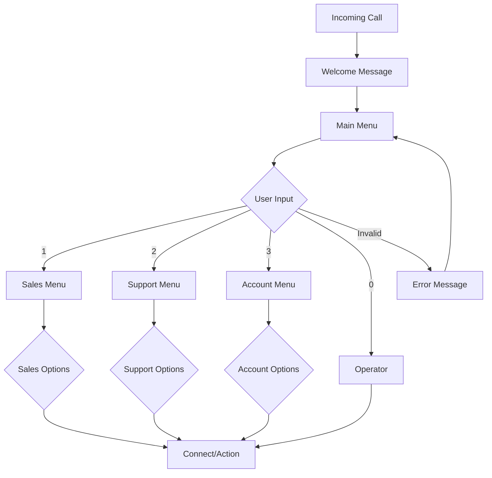

## Overview

Interactive Voice Response (IVR) systems allow callers to navigate menu options using voice or keypad input. Build sophisticated self-service applications with Tazzi's IVR capabilities.

<CardGroup cols={2}>
  <Card title="Menu Creation" icon="list" href="#creating-ivr-menus">
    Design and implement menu structures
  </Card>
  <Card title="DTMF Input" icon="keyboard" href="#handling-dtmf-input">
    Process keypad input from callers
  </Card>
  <Card title="Text-to-Speech" icon="volume" href="#text-to-speech">
    Generate dynamic voice prompts
  </Card>
  <Card title="Voicemail" icon="voicemail" href="#voicemail-systems">
    Implement voicemail collection
  </Card>
</CardGroup>

## Creating IVR Menus

### Basic Menu Structure

Create a simple IVR menu with options:

```javascript
const axios = require('axios');

const apiKey = 'your_api_key_here';
const apiUrl = 'https://api.tazzi.com';

async function createBasicIVR(callUuid) {
  const response = await axios.post(
    `${apiUrl}/v1/calls/${callUuid}/ivr`,
    {
      menu: {
        message: 'Thank you for calling. Press 1 for Sales, Press 2 for Support, Press 3 for Billing.',
        voice: 'en-US-Neural2-F',
        options: [
          {
            digit: '1',
            action: 'transfer',
            destination: '+15551111111',
            description: 'Sales'
          },
          {
            digit: '2',
            action: 'transfer',
            destination: '+15552222222',
            description: 'Support'
          },
          {
            digit: '3',
            action: 'transfer',
            destination: '+15553333333',
            description: 'Billing'
          },
          {
            digit: '0',
            action: 'transfer',
            destination: '+15559999999',
            description: 'Operator'
          }
        ],
        invalid_message: 'Invalid selection. Please try again.',
        timeout_message: 'We did not receive your selection.',
        timeout: 10, // seconds
        max_retries: 3
      }
    },
    {
      headers: {
        'X-API-Key': apiKey,
        'Content-Type': 'application/json'
      }
    }
  );

  return response.data;
}
```

### Multi-Level Menu

Build nested menu structures:

```javascript
async function createMultiLevelIVR(callUuid) {
  const response = await axios.post(
    `${apiUrl}/v1/calls/${callUuid}/ivr`,
    {
      menu: {
        id: 'main_menu',
        message: 'Welcome to ACME Corp. Press 1 for Sales, Press 2 for Support, Press 3 for Account Services.',
        voice: 'en-US-Neural2-F',
        options: [
          {
            digit: '1',
            action: 'submenu',
            submenu_id: 'sales_menu'
          },
          {
            digit: '2',
            action: 'submenu',
            submenu_id: 'support_menu'
          },
          {
            digit: '3',
            action: 'submenu',
            submenu_id: 'account_menu'
          },
          {
            digit: '*',
            action: 'return',
            description: 'Return to previous menu'
          },
          {
            digit: '0',
            action: 'transfer',
            destination: '+15559999999',
            description: 'Operator'
          }
        ],
        timeout: 10,
        max_retries: 3
      },
      submenus: [
        {
          id: 'sales_menu',
          message: 'Sales Department. Press 1 for New Customers, Press 2 for Existing Customers, Press Star to go back.',
          voice: 'en-US-Neural2-F',
          options: [
            {
              digit: '1',
              action: 'transfer',
              destination: '+15551111111'
            },
            {
              digit: '2',
              action: 'transfer',
              destination: '+15551111112'
            },
            {
              digit: '*',
              action: 'return'
            }
          ]
        },
        {
          id: 'support_menu',
          message: 'Technical Support. Press 1 for Product Issues, Press 2 for Technical Questions, Press Star to go back.',
          voice: 'en-US-Neural2-F',
          options: [
            {
              digit: '1',
              action: 'transfer',
              destination: '+15552222221'
            },
            {
              digit: '2',
              action: 'transfer',
              destination: '+15552222222'
            },
            {
              digit: '*',
              action: 'return'
            }
          ]
        },
        {
          id: 'account_menu',
          message: 'Account Services. Press 1 for Billing, Press 2 for Account Changes, Press 3 to make a payment, Press Star to go back.',
          voice: 'en-US-Neural2-F',
          options: [
            {
              digit: '1',
              action: 'transfer',
              destination: '+15553333331'
            },
            {
              digit: '2',
              action: 'transfer',
              destination: '+15553333332'
            },
            {
              digit: '3',
              action: 'webhook',
              webhook_url: 'https://yourapp.com/webhooks/ivr/payment'
            },
            {
              digit: '*',
              action: 'return'
            }
          ]
        }
      ]
    },
    {
      headers: {
        'X-API-Key': apiKey,
        'Content-Type': 'application/json'
      }
    }
  );

  return response.data;
}
```

### Dynamic Menu Generation

Create menus based on caller data or business logic:

```javascript
async function createDynamicIVR(callUuid, callerData) {
  // Fetch caller information
  const accountInfo = await getAccountInfo(callerData.phone);

  let menuOptions = [
    {
      digit: '1',
      action: 'transfer',
      destination: '+15552222222',
      description: 'Support'
    }
  ];

  // Add account-specific options
  if (accountInfo.hasPendingOrder) {
    menuOptions.push({
      digit: '2',
      action: 'webhook',
      webhook_url: 'https://yourapp.com/webhooks/ivr/order-status',
      description: 'Order Status'
    });
  }

  if (accountInfo.outstandingBalance > 0) {
    menuOptions.push({
      digit: '3',
      action: 'webhook',
      webhook_url: 'https://yourapp.com/webhooks/ivr/make-payment',
      description: 'Make Payment'
    });
  }

  const response = await axios.post(
    `${apiUrl}/v1/calls/${callUuid}/ivr`,
    {
      menu: {
        message: generateDynamicMessage(accountInfo),
        voice: 'en-US-Neural2-F',
        options: menuOptions,
        timeout: 10,
        max_retries: 3
      }
    },
    {
      headers: {
        'X-API-Key': apiKey,
        'Content-Type': 'application/json'
      }
    }
  );

  return response.data;
}

function generateDynamicMessage(accountInfo) {
  let message = `Hello ${accountInfo.firstName}. `;

  if (accountInfo.hasPendingOrder) {
    message += 'Press 2 for order status. ';
  }

  if (accountInfo.outstandingBalance > 0) {
    message += 'Press 3 to make a payment. ';
  }

  message += 'Press 1 for customer support. Press 0 for the operator.';

  return message;
}
```

## Handling DTMF Input

Process dual-tone multi-frequency (DTMF) keypad input.

### Basic DTMF Collection

```javascript
async function collectDTMF(callUuid, options) {
  const response = await axios.post(
    `${apiUrl}/v1/calls/${callUuid}/gather`,
    {
      num_digits: options.numDigits || 1,
      timeout: options.timeout || 10,
      finish_on_key: options.finishOnKey || '#',
      action_url: options.actionUrl,
      prompt: {
        text: options.promptText,
        voice: options.voice || 'en-US-Neural2-F',
        repeat: options.repeat || 1
      }
    },
    {
      headers: {
        'X-API-Key': apiKey,
        'Content-Type': 'application/json'
      }
    }
  );

  return response.data;
}

// Collect account number
await collectDTMF('call-uuid-123', {
  numDigits: 10,
  promptText: 'Please enter your 10-digit account number followed by the pound key.',
  finishOnKey: '#',
  actionUrl: 'https://yourapp.com/webhooks/ivr/account-lookup',
  timeout: 15
});

// Collect PIN
await collectDTMF('call-uuid-123', {
  numDigits: 4,
  promptText: 'Please enter your 4-digit PIN.',
  actionUrl: 'https://yourapp.com/webhooks/ivr/verify-pin',
  timeout: 10
});
```

### Processing DTMF Input

```javascript
const express = require('express');
const app = express();

app.post('/webhooks/ivr/account-lookup', express.json(), async (req, res) => {
  const { digits, call_uuid } = req.body.data;

  console.log('Received digits:', digits);

  // Validate account number
  const account = await lookupAccount(digits);

  if (account) {
    // Account found - provide options
    await axios.post(
      `${apiUrl}/v1/calls/${call_uuid}/say`,
      {
        text: `Welcome ${account.name}. Your account balance is ${account.balance} dollars.`,
        voice: 'en-US-Neural2-F'
      },
      {
        headers: {
          'X-API-Key': apiKey,
          'Content-Type': 'application/json'
        }
      }
    );

    // Continue to menu
    await createAccountMenu(call_uuid, account);
  } else {
    // Account not found - retry
    await axios.post(
      `${apiUrl}/v1/calls/${call_uuid}/say`,
      {
        text: 'Sorry, we could not find that account number. Please try again.',
        voice: 'en-US-Neural2-F'
      },
      {
        headers: {
          'X-API-Key': apiKey,
          'Content-Type': 'application/json'
        }
      }
    );

    // Retry collection
    await collectDTMF(call_uuid, {
      numDigits: 10,
      promptText: 'Please enter your account number.',
      actionUrl: 'https://yourapp.com/webhooks/ivr/account-lookup'
    });
  }

  res.status(200).send('OK');
});
```

### Advanced Input Validation

```javascript
async function collectAndValidateCreditCard(callUuid) {
  const response = await axios.post(
    `${apiUrl}/v1/calls/${callUuid}/gather`,
    {
      num_digits: 16,
      timeout: 20,
      finish_on_key: '#',
      action_url: 'https://yourapp.com/webhooks/ivr/process-payment',
      prompt: {
        text: 'Please enter your 16-digit credit card number followed by the pound key.',
        voice: 'en-US-Neural2-F'
      },
      validation: {
        type: 'credit_card',
        allow_test_cards: false
      }
    },
    {
      headers: {
        'X-API-Key': apiKey,
        'Content-Type': 'application/json'
      }
    }
  );

  return response.data;
}

app.post('/webhooks/ivr/process-payment', express.json(), async (req, res) => {
  const { digits, call_uuid, validation } = req.body.data;

  if (validation.valid) {
    console.log('Valid credit card number received');
    console.log('Card type:', validation.card_type); // visa, mastercard, amex, etc.

    // Process payment
    const result = await processPayment(digits, req.body.data.amount);

    if (result.success) {
      await axios.post(
        `${apiUrl}/v1/calls/${call_uuid}/say`,
        {
          text: `Your payment of ${result.amount} dollars has been processed. Your confirmation number is ${result.confirmation}.`,
          voice: 'en-US-Neural2-F'
        },
        {
          headers: {
            'X-API-Key': apiKey,
            'Content-Type': 'application/json'
          }
        }
      );
    }
  } else {
    console.log('Invalid credit card number');

    await axios.post(
      `${apiUrl}/v1/calls/${call_uuid}/say`,
      {
        text: 'The credit card number you entered is not valid. Please try again.',
        voice: 'en-US-Neural2-F'
      },
      {
        headers: {
          'X-API-Key': apiKey,
          'Content-Type': 'application/json'
        }
      }
    );
  }

  res.status(200).send('OK');
});
```

## Text-to-Speech

Generate natural-sounding voice prompts dynamically.

### Basic TTS

```javascript
async function playMessage(callUuid, text, options = {}) {
  const response = await axios.post(
    `${apiUrl}/v1/calls/${callUuid}/say`,
    {
      text: text,
      voice: options.voice || 'en-US-Neural2-F',
      language: options.language || 'en-US',
      speed: options.speed || 1.0, // 0.5 to 2.0
      pitch: options.pitch || 0, // -20 to 20
      loop: options.loop || 1
    },
    {
      headers: {
        'X-API-Key': apiKey,
        'Content-Type': 'application/json'
      }
    }
  );

  return response.data;
}

// Play welcome message
await playMessage('call-uuid-123', 'Welcome to ACME Corporation. Your call is important to us.');

// Play with custom voice settings
await playMessage('call-uuid-123', 'This is an urgent notification.', {
  voice: 'en-US-Neural2-C',
  speed: 0.9,
  pitch: 2
});
```

### Available Voices

```javascript
async function listAvailableVoices() {
  const response = await axios.get(
    `${apiUrl}/v1/tts/voices`,
    {
      headers: { 'X-API-Key': apiKey }
    }
  );

  console.log('Available voices:', response.data.voices);
  return response.data.voices;
}

// Example voices:
// - en-US-Neural2-F (Female)
// - en-US-Neural2-C (Male)
// - en-GB-Neural2-A (British Female)
// - es-ES-Neural2-A (Spanish Female)
// - fr-FR-Neural2-A (French Female)
```

### Dynamic Content

```javascript
async function playDynamicContent(callUuid, userData) {
  const message = `
    Hello ${userData.firstName}.
    Your current account balance is ${formatCurrency(userData.balance)}.
    You have ${userData.pendingOrders} pending orders.
    Your next payment of ${formatCurrency(userData.nextPayment)} is due on ${formatDate(userData.dueDate)}.
  `;

  await playMessage(callUuid, message);
}

function formatCurrency(amount) {
  return new Intl.NumberFormat('en-US', {
    style: 'currency',
    currency: 'USD'
  }).format(amount);
}

function formatDate(date) {
  return new Intl.DateTimeFormat('en-US', {
    month: 'long',
    day: 'numeric',
    year: 'numeric'
  }).format(new Date(date));
}
```

### SSML for Advanced Control

Use Speech Synthesis Markup Language for fine-tuned control:

```javascript
async function playSsmlMessage(callUuid) {
  const ssml = `
    <speak>
      <prosody rate="medium" pitch="default">
        Welcome to our <emphasis level="strong">automated</emphasis> payment system.
      </prosody>
      <break time="500ms"/>
      <prosody rate="slow">
        Your account balance is <say-as interpret-as="currency">$1,234.56</say-as>.
      </prosody>
      <break time="1s"/>
      <prosody pitch="+2st">
        Press 1 to make a payment, or press 2 to speak with a representative.
      </prosody>
    </speak>
  `;

  const response = await axios.post(
    `${apiUrl}/v1/calls/${callUuid}/say`,
    {
      ssml: ssml,
      voice: 'en-US-Neural2-F'
    },
    {
      headers: {
        'X-API-Key': apiKey,
        'Content-Type': 'application/json'
      }
    }
  );

  return response.data;
}
```

## Audio Playback

Play pre-recorded audio files instead of TTS.

```javascript
async function playAudio(callUuid, audioUrl, options = {}) {
  const response = await axios.post(
    `${apiUrl}/v1/calls/${callUuid}/play`,
    {
      audio_url: audioUrl,
      loop: options.loop || 1,
      digits: options.allowInterruption ? '0123456789*#' : null
    },
    {
      headers: {
        'X-API-Key': apiKey,
        'Content-Type': 'application/json'
      }
    }
  );

  return response.data;
}

// Play hold music
await playAudio('call-uuid-123', 'https://yourapp.com/audio/hold-music.mp3', {
  loop: 10,
  allowInterruption: true
});

// Play greeting
await playAudio('call-uuid-123', 'https://yourapp.com/audio/custom-greeting.wav');
```

## Voicemail Systems

Implement voicemail recording and retrieval.

### Recording Voicemail

```javascript
async function recordVoicemail(callUuid, options = {}) {
  const response = await axios.post(
    `${apiUrl}/v1/calls/${callUuid}/record`,
    {
      max_length: options.maxLength || 180, // seconds
      timeout: options.timeout || 5, // silence timeout
      finish_on_key: options.finishOnKey || '#',
      recording_status_callback: options.callbackUrl || 'https://yourapp.com/webhooks/voicemail',
      transcribe: options.transcribe || false,
      prompt: {
        text: options.promptText || 'Please leave a message after the beep. Press pound when finished.',
        voice: 'en-US-Neural2-F'
      }
    },
    {
      headers: {
        'X-API-Key': apiKey,
        'Content-Type': 'application/json'
      }
    }
  );

  return response.data;
}

// Record with custom settings
await recordVoicemail('call-uuid-123', {
  maxLength: 120,
  timeout: 3,
  transcribe: true,
  promptText: 'You have reached the voicemail of John Smith. Please leave a detailed message.',
  callbackUrl: 'https://yourapp.com/webhooks/voicemail-ready'
});
```

### Processing Voicemail

```javascript
app.post('/webhooks/voicemail-ready', express.json(), async (req, res) => {
  const voicemail = req.body.data;

  console.log('Voicemail received');
  console.log('Recording URL:', voicemail.recording_url);
  console.log('Duration:', voicemail.duration, 'seconds');
  console.log('From:', voicemail.from);

  if (voicemail.transcription) {
    console.log('Transcription:', voicemail.transcription.text);
    console.log('Confidence:', voicemail.transcription.confidence);
  }

  // Store voicemail
  await storeVoicemail({
    recordingUrl: voicemail.recording_url,
    duration: voicemail.duration,
    from: voicemail.from,
    transcription: voicemail.transcription?.text,
    timestamp: new Date()
  });

  // Send notification
  await sendVoicemailNotification(voicemail);

  res.status(200).send('OK');
});

async function sendVoicemailNotification(voicemail) {
  // Send email notification
  await axios.post(
    `${apiUrl}/v1/email/send`,
    {
      to: 'john.smith@company.com',
      subject: `New voicemail from ${voicemail.from}`,
      body: `
        You have a new voicemail.

        From: ${voicemail.from}
        Duration: ${voicemail.duration} seconds
        Time: ${new Date().toLocaleString()}

        ${voicemail.transcription ? `Transcription:\n${voicemail.transcription.text}` : ''}

        Listen: ${voicemail.recording_url}
      `
    },
    {
      headers: {
        'X-API-Key': apiKey,
        'Content-Type': 'application/json'
      }
    }
  );
}
```

### Voicemail Retrieval System

```javascript
async function createVoicemailRetrievalIVR(callUuid, extension) {
  // Get voicemails for extension
  const voicemails = await getVoicemails(extension);

  if (voicemails.length === 0) {
    await playMessage(callUuid, 'You have no new voicemails.');
    return;
  }

  await playMessage(callUuid, `You have ${voicemails.length} new voicemails.`);

  for (let i = 0; i < voicemails.length; i++) {
    const vm = voicemails[i];

    // Play voicemail info
    await playMessage(callUuid, `Message ${i + 1} from ${vm.from}, received at ${formatTime(vm.timestamp)}.`);

    // Play the voicemail
    await playAudio(callUuid, vm.recording_url);

    // Voicemail options menu
    await collectDTMF(callUuid, {
      numDigits: 1,
      promptText: 'Press 1 to repeat, Press 2 to delete, Press 3 for next message, Press 9 to save.',
      actionUrl: `https://yourapp.com/webhooks/voicemail-action?id=${vm.id}&index=${i}`
    });
  }
}
```

## IVR Flow Diagram



## Best Practices

<AccordionGroup>
  <Accordion title="Menu Design">
    - Keep menus simple (3-5 options per level)
    - Use logical grouping for options
    - Provide operator fallback (press 0)
    - Allow callers to return to previous menu
    - Order options by frequency of use
    - Keep prompts concise and clear
  </Accordion>

  <Accordion title="User Experience">
    - Allow interruption with keypad input
    - Set reasonable timeouts (8-10 seconds)
    - Limit menu depth to 2-3 levels
    - Provide confirmation for critical actions
    - Offer replay option for complex menus
    - Use natural, conversational language
  </Accordion>

  <Accordion title="DTMF Collection">
    - Clearly state expected input length
    - Use # as terminator for variable-length input
    - Implement input validation
    - Provide retry logic (3 attempts max)
    - Offer help option (* key)
    - Give clear feedback on invalid input
  </Accordion>

  <Accordion title="Voice Prompts">
    - Use consistent voice across system
    - Record custom audio for brand consistency
    - Test TTS pronunciation of brand terms
    - Keep messages under 30 seconds
    - Update messages for holidays/hours
    - A/B test different prompt styles
  </Accordion>
</AccordionGroup>

## Related Resources

<CardGroup cols={2}>
  <Card
    title="Call Control"
    icon="phone-volume"
    href="/guides/making-calls"
  >
    Advanced call handling features
  </Card>
  <Card
    title="Call Recording"
    icon="record-vinyl"
    href="/guides/call-recording"
  >
    Record and store conversations
  </Card>
  <Card
    title="Webhooks"
    icon="webhook"
    href="/concepts/webhooks"
  >
    Handle IVR events in real-time
  </Card>
  <Card
    title="TTS API Reference"
    icon="book"
    href="/api-reference/tts"
  >
    Text-to-speech documentation
  </Card>
</CardGroup>

## Next Steps

Enhance your IVR system:

- [Implement webhook handlers](/guides/webhook-handlers) for dynamic routing
- [Add call recording](/guides/call-recording) for quality assurance
- [Handle errors gracefully](/guides/error-handling) for reliability

Questions? Join our [Discord community](https://discord.gg/tazzi) or email support@tazzi.com.
