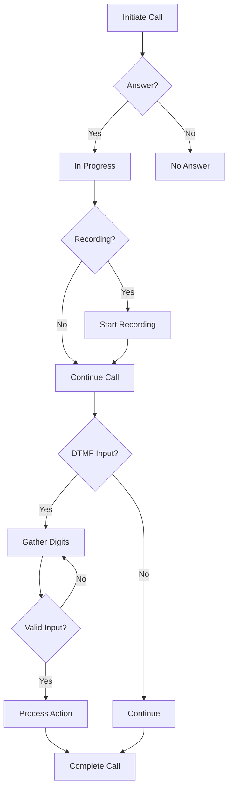

## Overview

IRISX provides comprehensive call control capabilities for building sophisticated voice applications. This guide covers advanced features beyond basic calling.

<CardGroup cols={2}>
  <Card title="Call Control" icon="sliders" href="#call-control">
    Pause, resume, mute, and transfer calls
  </Card>
  <Card title="Conference Calls" icon="users" href="#conference-calls">
    Create multi-party conference rooms
  </Card>
  <Card title="Call Recording" icon="record-vinyl" href="#call-recording">
    Record and access call audio
  </Card>
  <Card title="DTMF Handling" icon="keyboard" href="#dtmf-handling">
    Capture and process keypad input
  </Card>
</CardGroup>

## Call Control

Control active calls in real-time with pause, resume, mute, and transfer operations.

### Pause and Resume

Temporarily pause call audio:

```javascript
const axios = require('axios');

const apiKey = 'your_api_key_here';
const apiUrl = 'https://api.useiris.com';

async function pauseCall(callUuid) {
  const response = await axios.post(
    `${apiUrl}/v1/calls/${callUuid}/pause`,
    {},
    {
      headers: {
        'X-API-Key': apiKey,
        'Content-Type': 'application/json'
      }
    }
  );

  console.log('Call paused:', response.data.call.status);
  return response.data;
}

async function resumeCall(callUuid) {
  const response = await axios.post(
    `${apiUrl}/v1/calls/${callUuid}/resume`,
    {},
    {
      headers: {
        'X-API-Key': apiKey,
        'Content-Type': 'application/json'
      }
    }
  );

  console.log('Call resumed:', response.data.call.status);
  return response.data;
}

// Usage
await pauseCall('123e4567-e89b-12d3-a456-426614174000');
await new Promise(resolve => setTimeout(resolve, 5000)); // Wait 5 seconds
await resumeCall('123e4567-e89b-12d3-a456-426614174000');
```

### Mute Participants

Mute or unmute specific call participants:

```javascript
async function muteParticipant(callUuid, participantId) {
  const response = await axios.post(
    `${apiUrl}/v1/calls/${callUuid}/participants/${participantId}/mute`,
    { muted: true },
    {
      headers: {
        'X-API-Key': apiKey,
        'Content-Type': 'application/json'
      }
    }
  );

  return response.data;
}

async function unmuteParticipant(callUuid, participantId) {
  const response = await axios.post(
    `${apiUrl}/v1/calls/${callUuid}/participants/${participantId}/mute`,
    { muted: false },
    {
      headers: {
        'X-API-Key': apiKey,
        'Content-Type': 'application/json'
      }
    }
  );

  return response.data;
}
```

### Call Transfer

Transfer active calls to another number:

```javascript
async function transferCall(callUuid, transferTo) {
  const response = await axios.post(
    `${apiUrl}/v1/calls/${callUuid}/transfer`,
    {
      to: transferTo,
      type: 'blind' // or 'attended'
    },
    {
      headers: {
        'X-API-Key': apiKey,
        'Content-Type': 'application/json'
      }
    }
  );

  console.log('Call transferred to:', transferTo);
  return response.data;
}

// Blind transfer (immediate)
await transferCall('123e4567-e89b-12d3-a456-426614174000', '+15551234567');

// Attended transfer (with introduction)
async function attendedTransfer(callUuid, transferTo) {
  const response = await axios.post(
    `${apiUrl}/v1/calls/${callUuid}/transfer`,
    {
      to: transferTo,
      type: 'attended',
      introduction: 'Customer needs assistance with billing'
    },
    {
      headers: {
        'X-API-Key': apiKey,
        'Content-Type': 'application/json'
      }
    }
  );

  return response.data;
}
```

<Note>
  Attended transfers allow the transferring party to speak with the recipient before completing the transfer.
</Note>

## Conference Calls

Create and manage multi-party conference calls.

### Creating a Conference

```javascript
async function createConference() {
  const response = await axios.post(
    `${apiUrl}/v1/conferences`,
    {
      name: 'Team Standup',
      max_participants: 10,
      record: true,
      wait_music: true,
      beep_on_enter: true,
      beep_on_exit: true
    },
    {
      headers: {
        'X-API-Key': apiKey,
        'Content-Type': 'application/json'
      }
    }
  );

  console.log('Conference created:', response.data.conference.id);
  console.log('Conference PIN:', response.data.conference.pin);

  return response.data.conference;
}
```

### Adding Participants

```javascript
async function addParticipant(conferenceId, phoneNumber) {
  const response = await axios.post(
    `${apiUrl}/v1/conferences/${conferenceId}/participants`,
    {
      phone_number: phoneNumber,
      muted: false,
      hold: false,
      start_conference_on_enter: true
    },
    {
      headers: {
        'X-API-Key': apiKey,
        'Content-Type': 'application/json'
      }
    }
  );

  console.log('Participant added:', response.data.participant.id);
  return response.data.participant;
}

// Add multiple participants
const conference = await createConference();
await addParticipant(conference.id, '+15551111111');
await addParticipant(conference.id, '+15552222222');
await addParticipant(conference.id, '+15553333333');
```

### Managing Conference Participants

```javascript
// List all participants
async function listParticipants(conferenceId) {
  const response = await axios.get(
    `${apiUrl}/v1/conferences/${conferenceId}/participants`,
    {
      headers: { 'X-API-Key': apiKey }
    }
  );

  return response.data.participants;
}

// Remove a participant
async function removeParticipant(conferenceId, participantId) {
  await axios.delete(
    `${apiUrl}/v1/conferences/${conferenceId}/participants/${participantId}`,
    {
      headers: { 'X-API-Key': apiKey }
    }
  );

  console.log('Participant removed');
}

// Mute all participants
async function muteAll(conferenceId) {
  const participants = await listParticipants(conferenceId);

  for (const participant of participants) {
    await muteParticipant(conferenceId, participant.id);
  }

  console.log('All participants muted');
}
```

## Call Queuing

Implement intelligent call queuing for managing high call volumes.

```javascript
async function createCallQueue() {
  const response = await axios.post(
    `${apiUrl}/v1/queues`,
    {
      name: 'Support Queue',
      max_size: 50,
      timeout: 300, // 5 minutes
      strategy: 'longest-idle-agent',
      hold_music_url: 'https://yourapp.com/audio/hold-music.mp3',
      periodic_announce_frequency: 30, // seconds
      periodic_announce_url: 'https://yourapp.com/audio/position-announce.mp3'
    },
    {
      headers: {
        'X-API-Key': apiKey,
        'Content-Type': 'application/json'
      }
    }
  );

  return response.data.queue;
}

async function enqueueCall(queueId, callUuid) {
  const response = await axios.post(
    `${apiUrl}/v1/queues/${queueId}/calls`,
    {
      call_uuid: callUuid,
      priority: 1 // Higher numbers = higher priority
    },
    {
      headers: {
        'X-API-Key': apiKey,
        'Content-Type': 'application/json'
      }
    }
  );

  return response.data;
}

// Get queue statistics
async function getQueueStats(queueId) {
  const response = await axios.get(
    `${apiUrl}/v1/queues/${queueId}/stats`,
    {
      headers: { 'X-API-Key': apiKey }
    }
  );

  console.log('Calls in queue:', response.data.stats.calls_waiting);
  console.log('Average wait time:', response.data.stats.avg_wait_time);
  console.log('Longest wait time:', response.data.stats.max_wait_time);

  return response.data.stats;
}
```

<Warning>
  Set appropriate queue timeouts to prevent callers from waiting indefinitely. Consider implementing overflow routing after timeout.
</Warning>

## Call Recording

Record calls for quality assurance, compliance, and training.

### Enable Recording

```javascript
async function makeRecordedCall() {
  const response = await axios.post(
    `${apiUrl}/v1/calls`,
    {
      to: '+15551234567',
      from: '+15559876543',
      record: true,
      recording_channels: 'dual', // 'mono' or 'dual'
      recording_status_callback: 'https://yourapp.com/webhooks/recording-ready'
    },
    {
      headers: {
        'X-API-Key': apiKey,
        'Content-Type': 'application/json'
      }
    }
  );

  return response.data.call;
}

// Start recording mid-call
async function startRecording(callUuid) {
  const response = await axios.post(
    `${apiUrl}/v1/calls/${callUuid}/recordings`,
    {
      channels: 'dual'
    },
    {
      headers: {
        'X-API-Key': apiKey,
        'Content-Type': 'application/json'
      }
    }
  );

  console.log('Recording started:', response.data.recording.id);
  return response.data.recording;
}

// Stop recording
async function stopRecording(callUuid, recordingId) {
  await axios.delete(
    `${apiUrl}/v1/calls/${callUuid}/recordings/${recordingId}`,
    {
      headers: { 'X-API-Key': apiKey }
    }
  );

  console.log('Recording stopped');
}
```

### Access Recordings

```javascript
async function getRecording(recordingId) {
  const response = await axios.get(
    `${apiUrl}/v1/recordings/${recordingId}`,
    {
      headers: { 'X-API-Key': apiKey }
    }
  );

  console.log('Recording URL:', response.data.recording.url);
  console.log('Duration:', response.data.recording.duration, 'seconds');

  return response.data.recording;
}

// Download recording
async function downloadRecording(recordingId, savePath) {
  const recording = await getRecording(recordingId);

  const response = await axios.get(recording.url, {
    responseType: 'arraybuffer'
  });

  const fs = require('fs');
  fs.writeFileSync(savePath, response.data);

  console.log('Recording saved to:', savePath);
}
```

## DTMF Handling

Capture and process dual-tone multi-frequency (DTMF) keypad input.

```javascript
async function collectDTMF(callUuid) {
  const response = await axios.post(
    `${apiUrl}/v1/calls/${callUuid}/gather`,
    {
      num_digits: 4,
      timeout: 10,
      finish_on_key: '#',
      action_url: 'https://yourapp.com/webhooks/dtmf',
      prompt: {
        text: 'Please enter your 4-digit PIN followed by the pound key',
        voice: 'en-US-Neural2-F'
      }
    },
    {
      headers: {
        'X-API-Key': apiKey,
        'Content-Type': 'application/json'
      }
    }
  );

  return response.data;
}

// Webhook handler for DTMF input
async function handleDTMFWebhook(req, res) {
  const { digits, call_uuid } = req.body.data;

  console.log('Received DTMF input:', digits);

  // Validate PIN
  if (digits === '1234') {
    // Correct PIN - continue call
    await axios.post(
      `${apiUrl}/v1/calls/${call_uuid}/say`,
      {
        text: 'PIN accepted. Connecting you now.',
        voice: 'en-US-Neural2-F'
      },
      {
        headers: {
          'X-API-Key': apiKey,
          'Content-Type': 'application/json'
        }
      }
    );
  } else {
    // Incorrect PIN - retry
    await collectDTMF(call_uuid);
  }

  res.status(200).send('OK');
}
```

## Call Whisper and Barge

Monitor and interact with active calls for coaching and quality assurance.

### Call Whisper

Listen to a call and speak to one party without the other hearing:

```javascript
async function whisperToAgent(callUuid, agentLeg) {
  const response = await axios.post(
    `${apiUrl}/v1/calls/${callUuid}/whisper`,
    {
      to_leg: agentLeg, // 'caller' or 'callee'
      text: 'Remember to offer the premium support package',
      voice: 'en-US-Neural2-C'
    },
    {
      headers: {
        'X-API-Key': apiKey,
        'Content-Type': 'application/json'
      }
    }
  );

  return response.data;
}
```

### Call Barge

Join an active call as a third participant:

```javascript
async function bargeIntoCall(callUuid, phoneNumber) {
  const response = await axios.post(
    `${apiUrl}/v1/calls/${callUuid}/barge`,
    {
      phone_number: phoneNumber,
      mode: 'coach', // 'coach', 'monitor', or 'barge'
      announcement: 'A supervisor is joining the call'
    },
    {
      headers: {
        'X-API-Key': apiKey,
        'Content-Type': 'application/json'
      }
    }
  );

  return response.data;
}
```

<Accordion title="Barge Modes Explained">
  - **Monitor**: Listen to both parties without being heard
  - **Coach**: Speak to the agent only (whisper mode)
  - **Barge**: Join as a full participant (all parties hear you)
</Accordion>

## Call Flow Diagram



## Best Practices

<AccordionGroup>
  <Accordion title="Call Recording Compliance">
    - Always obtain consent before recording calls
    - Inform participants at the beginning of the call
    - Follow regional regulations (e.g., one-party vs two-party consent)
    - Implement secure storage with encryption
    - Set retention policies and auto-delete old recordings
  </Accordion>

  <Accordion title="Conference Call Management">
    - Set reasonable max participant limits
    - Use PINs for private conferences
    - Implement moderator controls (mute all, remove participants)
    - Monitor participant count and handle overflow
    - Provide clear audio announcements for join/leave events
  </Accordion>

  <Accordion title="Queue Management">
    - Set appropriate timeout values
    - Provide position and wait time announcements
    - Implement callback options for long queues
    - Monitor queue metrics in real-time
    - Have overflow routes for full queues
  </Accordion>

  <Accordion title="DTMF Collection">
    - Keep prompts clear and concise
    - Allow sufficient timeout for input
    - Provide retry logic for invalid input
    - Limit retry attempts to prevent frustration
    - Offer operator fallback option
  </Accordion>
</AccordionGroup>

## Related Resources

<CardGroup cols={2}>
  <Card
    title="IVR Menus"
    icon="list-tree"
    href="/guides/ivr-menus"
  >
    Build interactive voice response systems
  </Card>
  <Card
    title="Call Recording Guide"
    icon="circle-dot"
    href="/guides/call-recording"
  >
    Detailed recording implementation
  </Card>
  <Card
    title="Webhooks"
    icon="webhook"
    href="/concepts/webhooks"
  >
    Handle real-time call events
  </Card>
  <Card
    title="Calls API Reference"
    icon="book"
    href="/api-reference/calls"
  >
    Complete API documentation
  </Card>
</CardGroup>

## Next Steps

Now that you understand advanced call control, explore:

- [Building IVR menus](/guides/ivr-menus) for self-service options
- [Webhook handlers](/guides/webhook-handlers) for real-time processing
- [Error handling](/guides/error-handling) for robust applications

Need help? Join our [Discord community](https://discord.gg/irisx) or email support@useiris.com.
