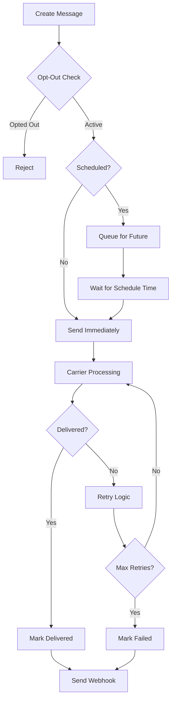

## Overview

Tazzi provides a robust SMS platform for sending transactional messages, marketing campaigns, and customer communications. This guide covers everything from basic messaging to advanced bulk operations.

<CardGroup cols={2}>
  <Card title="Basic Messaging" icon="message" href="#sending-messages">
    Send single and bulk SMS messages
  </Card>
  <Card title="Scheduling" icon="clock" href="#scheduling-messages">
    Schedule messages for future delivery
  </Card>
  <Card title="Delivery Tracking" icon="chart-line" href="#tracking-delivery">
    Track delivery status in real-time
  </Card>
  <Card title="Compliance" icon="shield-check" href="#compliance">
    A2P 10DLC and opt-out management
  </Card>
</CardGroup>

## Sending Messages

### Basic SMS

Send a simple text message:

```javascript
const axios = require('axios');

const apiKey = 'your_api_key_here';
const apiUrl = 'https://api.tazzi.com';

async function sendSMS(to, message) {
  const response = await axios.post(
    `${apiUrl}/v1/sms/send`,
    {
      to: to,
      from: '+15559876543', // Your Tazzi number
      body: message
    },
    {
      headers: {
        'X-API-Key': apiKey,
        'Content-Type': 'application/json'
      }
    }
  );

  console.log('Message ID:', response.data.message.id);
  console.log('Status:', response.data.message.status);

  return response.data.message;
}

// Send a message
await sendSMS('+15551234567', 'Your verification code is 123456');
```

### SMS with Rich Features

```javascript
async function sendRichSMS(to, options) {
  const response = await axios.post(
    `${apiUrl}/v1/sms/send`,
    {
      to: to,
      from: options.from,
      body: options.body,
      media_urls: options.mediaUrls, // MMS images/videos
      status_callback: options.statusCallback,
      validity_period: options.validityPeriod || 4320, // minutes (default: 3 days)
      schedule_time: options.scheduleTime, // ISO 8601 format
      max_price: options.maxPrice // Maximum price per message
    },
    {
      headers: {
        'X-API-Key': apiKey,
        'Content-Type': 'application/json'
      }
    }
  );

  return response.data.message;
}

// Send MMS with image
await sendRichSMS('+15551234567', {
  from: '+15559876543',
  body: 'Check out our new product!',
  mediaUrls: ['https://yourapp.com/images/product.jpg'],
  statusCallback: 'https://yourapp.com/webhooks/sms-status'
});
```

<Note>
  MMS (Multimedia Messaging Service) supports images, videos, and audio files up to 5MB. Check carrier support before sending.
</Note>

## Bulk Messaging

Send messages to multiple recipients efficiently.

### Batch Sending

```javascript
async function sendBulkSMS(recipients, message, from) {
  const response = await axios.post(
    `${apiUrl}/v1/sms/bulk`,
    {
      from: from,
      body: message,
      recipients: recipients,
      batch_size: 100, // Process in batches
      rate_limit: 10 // Messages per second
    },
    {
      headers: {
        'X-API-Key': apiKey,
        'Content-Type': 'application/json'
      }
    }
  );

  console.log('Batch ID:', response.data.batch.id);
  console.log('Total recipients:', response.data.batch.total_count);
  console.log('Status:', response.data.batch.status);

  return response.data.batch;
}

// Send to multiple recipients
const recipients = [
  '+15551111111',
  '+15552222222',
  '+15553333333',
  '+15554444444'
];

const batch = await sendBulkSMS(
  recipients,
  'Important update: Your appointment is confirmed for tomorrow at 2 PM.',
  '+15559876543'
);
```

### Personalized Bulk Messages

```javascript
async function sendPersonalizedBulk(contacts, templateBody, from) {
  const messages = contacts.map(contact => ({
    to: contact.phone,
    body: templateBody
      .replace('{{name}}', contact.name)
      .replace('{{date}}', contact.appointmentDate)
      .replace('{{location}}', contact.location)
  }));

  const response = await axios.post(
    `${apiUrl}/v1/sms/bulk`,
    {
      from: from,
      messages: messages, // Array of personalized messages
      batch_size: 50,
      validate_numbers: true // Pre-validate phone numbers
    },
    {
      headers: {
        'X-API-Key': apiKey,
        'Content-Type': 'application/json'
      }
    }
  );

  return response.data.batch;
}

// Usage with template
const contacts = [
  { phone: '+15551111111', name: 'John', appointmentDate: 'Oct 30', location: 'Downtown Clinic' },
  { phone: '+15552222222', name: 'Jane', appointmentDate: 'Oct 31', location: 'West Side Office' }
];

const template = 'Hi {{name}}, your appointment at {{location}} is scheduled for {{date}}.';

await sendPersonalizedBulk(contacts, template, '+15559876543');
```

### Monitor Batch Progress

```javascript
async function getBatchStatus(batchId) {
  const response = await axios.get(
    `${apiUrl}/v1/sms/batches/${batchId}`,
    {
      headers: { 'X-API-Key': apiKey }
    }
  );

  const batch = response.data.batch;

  console.log('Progress:', batch.processed_count, '/', batch.total_count);
  console.log('Delivered:', batch.delivered_count);
  console.log('Failed:', batch.failed_count);
  console.log('Status:', batch.status);

  return batch;
}

// Poll batch status
async function waitForBatchCompletion(batchId) {
  let batch;
  do {
    batch = await getBatchStatus(batchId);
    await new Promise(resolve => setTimeout(resolve, 2000)); // Wait 2 seconds
  } while (batch.status === 'processing');

  return batch;
}
```

<Warning>
  For bulk messaging, ensure you have proper opt-in consent from all recipients. Unsolicited messages may violate regulations and result in account suspension.
</Warning>

## Message Templates

Create reusable templates for consistent messaging.

### Creating Templates

```javascript
async function createMessageTemplate(name, body, category) {
  const response = await axios.post(
    `${apiUrl}/v1/sms/templates`,
    {
      name: name,
      body: body,
      category: category, // 'transactional', 'marketing', 'notification'
      variables: ['name', 'code', 'amount'], // Template variables
      sample_values: {
        name: 'John Doe',
        code: '123456',
        amount: '$50.00'
      }
    },
    {
      headers: {
        'X-API-Key': apiKey,
        'Content-Type': 'application/json'
      }
    }
  );

  console.log('Template created:', response.data.template.id);
  return response.data.template;
}

// Create verification code template
await createMessageTemplate(
  'verification-code',
  'Hi {{name}}, your verification code is {{code}}. Valid for 10 minutes.',
  'transactional'
);

// Create payment reminder template
await createMessageTemplate(
  'payment-reminder',
  'Reminder: Your payment of {{amount}} is due tomorrow. Reply PAID to confirm.',
  'notification'
);
```

### Using Templates

```javascript
async function sendFromTemplate(templateId, to, variables) {
  const response = await axios.post(
    `${apiUrl}/v1/sms/send`,
    {
      to: to,
      from: '+15559876543',
      template_id: templateId,
      variables: variables
    },
    {
      headers: {
        'X-API-Key': apiKey,
        'Content-Type': 'application/json'
      }
    }
  );

  return response.data.message;
}

// Send using template
await sendFromTemplate('tpl_123abc', '+15551234567', {
  name: 'Alice',
  code: '789012',
  amount: '$75.00'
});
```

## Scheduling Messages

Schedule messages for future delivery.

### Single Scheduled Message

```javascript
async function scheduleMessage(to, body, scheduleTime) {
  const response = await axios.post(
    `${apiUrl}/v1/sms/send`,
    {
      to: to,
      from: '+15559876543',
      body: body,
      schedule_time: scheduleTime // ISO 8601: '2025-10-31T14:00:00Z'
    },
    {
      headers: {
        'X-API-Key': apiKey,
        'Content-Type': 'application/json'
      }
    }
  );

  console.log('Scheduled message ID:', response.data.message.id);
  console.log('Scheduled for:', response.data.message.schedule_time);

  return response.data.message;
}

// Schedule message for tomorrow
const tomorrow = new Date();
tomorrow.setDate(tomorrow.getDate() + 1);
tomorrow.setHours(14, 0, 0, 0);

await scheduleMessage(
  '+15551234567',
  'Reminder: Your appointment is today at 2 PM',
  tomorrow.toISOString()
);
```

### Recurring Messages

```javascript
async function createRecurringMessage(options) {
  const response = await axios.post(
    `${apiUrl}/v1/sms/recurring`,
    {
      from: options.from,
      to: options.to,
      body: options.body,
      schedule: {
        frequency: 'weekly', // 'daily', 'weekly', 'monthly'
        day_of_week: 1, // Monday (0-6)
        time: '09:00', // HH:mm in timezone
        timezone: 'America/New_York'
      },
      start_date: options.startDate,
      end_date: options.endDate
    },
    {
      headers: {
        'X-API-Key': apiKey,
        'Content-Type': 'application/json'
      }
    }
  );

  return response.data.recurring_message;
}

// Weekly reminder every Monday at 9 AM
await createRecurringMessage({
  from: '+15559876543',
  to: '+15551234567',
  body: 'Weekly reminder: Submit your timesheet today!',
  startDate: '2025-11-01',
  endDate: '2025-12-31'
});
```

### Cancel Scheduled Messages

```javascript
async function cancelScheduledMessage(messageId) {
  await axios.delete(
    `${apiUrl}/v1/sms/${messageId}`,
    {
      headers: { 'X-API-Key': apiKey }
    }
  );

  console.log('Scheduled message cancelled');
}

// List scheduled messages
async function listScheduledMessages() {
  const response = await axios.get(
    `${apiUrl}/v1/sms?status=scheduled`,
    {
      headers: { 'X-API-Key': apiKey }
    }
  );

  return response.data.messages;
}
```

## Tracking Delivery

Monitor message delivery status in real-time.

### Delivery Status

```javascript
async function getMessageStatus(messageId) {
  const response = await axios.get(
    `${apiUrl}/v1/sms/${messageId}`,
    {
      headers: { 'X-API-Key': apiKey }
    }
  );

  const message = response.data.message;

  console.log('Status:', message.status);
  console.log('Sent at:', message.sent_at);
  console.log('Delivered at:', message.delivered_at);
  console.log('Price:', message.price);

  return message;
}

// Status values: queued, sending, sent, delivered, failed, undelivered
```

### Webhook Status Updates

```javascript
// Express.js webhook handler
const express = require('express');
const app = express();

app.post('/webhooks/sms-status', express.json(), (req, res) => {
  const event = req.body;

  console.log('Message:', event.data.id);
  console.log('Status:', event.data.status);
  console.log('To:', event.data.to);

  // Handle different statuses
  switch (event.data.status) {
    case 'delivered':
      console.log('Message delivered successfully');
      // Update database, send confirmation, etc.
      break;

    case 'failed':
    case 'undelivered':
      console.log('Delivery failed:', event.data.error_code);
      console.log('Error:', event.data.error_message);
      // Retry logic, alert admin, etc.
      break;

    case 'sent':
      console.log('Message sent to carrier');
      break;
  }

  res.status(200).send('OK');
});

app.listen(3000);
```

### Delivery Reports

```javascript
async function getDeliveryReport(startDate, endDate) {
  const response = await axios.get(
    `${apiUrl}/v1/sms/reports/delivery`,
    {
      params: {
        start_date: startDate,
        end_date: endDate,
        group_by: 'status' // or 'date', 'destination'
      },
      headers: { 'X-API-Key': apiKey }
    }
  );

  const report = response.data.report;

  console.log('Total messages:', report.total_count);
  console.log('Delivered:', report.delivered_count);
  console.log('Failed:', report.failed_count);
  console.log('Delivery rate:', report.delivery_rate);

  return report;
}
```

## Opt-Out Management

Comply with regulations by managing opt-outs properly.

### Handling Opt-Outs

```javascript
async function handleIncomingSMS(req, res) {
  const inbound = req.body.data;

  const message = inbound.body.toLowerCase().trim();
  const from = inbound.from;

  // Check for opt-out keywords
  const optOutKeywords = ['stop', 'unsubscribe', 'cancel', 'end', 'quit'];

  if (optOutKeywords.includes(message)) {
    // Add to opt-out list
    await addToOptOutList(from);

    // Send confirmation
    await sendSMS(from, 'You have been unsubscribed. Reply START to re-subscribe.');

    console.log('Opt-out processed for:', from);
  } else if (message === 'start') {
    // Remove from opt-out list
    await removeFromOptOutList(from);

    // Send confirmation
    await sendSMS(from, 'You have been re-subscribed. Reply STOP to unsubscribe.');

    console.log('Opt-in processed for:', from);
  }

  res.status(200).send('OK');
}

async function addToOptOutList(phoneNumber) {
  await axios.post(
    `${apiUrl}/v1/sms/opt-outs`,
    {
      phone_number: phoneNumber,
      source: 'sms-reply'
    },
    {
      headers: {
        'X-API-Key': apiKey,
        'Content-Type': 'application/json'
      }
    }
  );
}

async function removeFromOptOutList(phoneNumber) {
  await axios.delete(
    `${apiUrl}/v1/sms/opt-outs/${phoneNumber}`,
    {
      headers: { 'X-API-Key': apiKey }
    }
  );
}
```

### Check Opt-Out Status

```javascript
async function isOptedOut(phoneNumber) {
  try {
    const response = await axios.get(
      `${apiUrl}/v1/sms/opt-outs/${phoneNumber}`,
      {
        headers: { 'X-API-Key': apiKey }
      }
    );

    return response.data.opted_out;
  } catch (error) {
    if (error.response?.status === 404) {
      return false; // Not in opt-out list
    }
    throw error;
  }
}

// Check before sending
async function sendSMSWithOptOutCheck(to, body, from) {
  if (await isOptedOut(to)) {
    console.log('Cannot send - recipient has opted out');
    return null;
  }

  return await sendSMS(to, body, from);
}
```

## A2P 10DLC Registration

Register your brand and campaigns for Application-to-Person (A2P) messaging.

### Brand Registration

```javascript
async function registerBrand() {
  const response = await axios.post(
    `${apiUrl}/v1/sms/a2p/brands`,
    {
      legal_name: 'Your Company Inc.',
      display_name: 'Your Company',
      business_type: 'corporation', // or 'llc', 'nonprofit', etc.
      ein: '12-3456789', // Tax ID
      website: 'https://yourcompany.com',
      address: {
        street: '123 Main St',
        city: 'San Francisco',
        state: 'CA',
        postal_code: '94105',
        country: 'US'
      },
      contact: {
        name: 'John Doe',
        email: 'compliance@yourcompany.com',
        phone: '+15551234567'
      }
    },
    {
      headers: {
        'X-API-Key': apiKey,
        'Content-Type': 'application/json'
      }
    }
  );

  console.log('Brand registered:', response.data.brand.id);
  console.log('Status:', response.data.brand.status);

  return response.data.brand;
}
```

### Campaign Registration

```javascript
async function registerCampaign(brandId) {
  const response = await axios.post(
    `${apiUrl}/v1/sms/a2p/campaigns`,
    {
      brand_id: brandId,
      use_case: 'mixed', // 'marketing', 'customer_care', 'account_notifications', etc.
      description: 'Customer notifications and marketing messages',
      sample_messages: [
        'Your order #12345 has shipped and will arrive tomorrow.',
        'Special offer: 20% off your next purchase! Use code SAVE20.',
        'Reminder: Your appointment is scheduled for tomorrow at 2 PM.'
      ],
      message_volume: 'high', // 'low', 'medium', 'high'
      opt_in_message: 'Reply YES to receive updates from Your Company. Reply STOP to opt out.',
      opt_out_keywords: ['STOP', 'UNSUBSCRIBE', 'CANCEL'],
      help_message: 'For help, email support@yourcompany.com or call 1-555-123-4567.'
    },
    {
      headers: {
        'X-API-Key': apiKey,
        'Content-Type': 'application/json'
      }
    }
  );

  console.log('Campaign registered:', response.data.campaign.id);
  console.log('Status:', response.data.campaign.status);

  return response.data.campaign;
}
```

<Note>
  A2P 10DLC registration is required for high-volume messaging in the US. Registration typically takes 5-7 business days.
</Note>

## Best Practices

<AccordionGroup>
  <Accordion title="Message Content">
    - Keep messages under 160 characters when possible
    - Include clear call-to-action
    - Identify your brand/business name
    - Avoid excessive capitalization or exclamation marks
    - Don't use URL shorteners (can trigger spam filters)
    - Include opt-out instructions in marketing messages
  </Accordion>

  <Accordion title="Bulk Messaging">
    - Segment your audience for targeted messaging
    - Personalize messages with recipient names
    - Send during appropriate hours (9 AM - 8 PM local time)
    - Throttle send rates to avoid carrier filtering
    - Monitor delivery rates and adjust strategies
    - Use different phone numbers for high-volume campaigns
  </Accordion>

  <Accordion title="Compliance">
    - Obtain explicit opt-in consent before messaging
    - Honor opt-out requests immediately
    - Keep records of consent and opt-outs
    - Include business name in messages
    - Provide clear opt-out instructions
    - Follow TCPA, CAN-SPAM, and carrier guidelines
  </Accordion>

  <Accordion title="Performance">
    - Use webhooks instead of polling for status
    - Batch messages for better throughput
    - Cache opt-out lists to reduce API calls
    - Implement retry logic with exponential backoff
    - Monitor delivery rates by carrier and region
  </Accordion>
</AccordionGroup>

## SMS Flow Diagram



## Related Resources

<CardGroup cols={2}>
  <Card
    title="Webhooks"
    icon="webhook"
    href="/concepts/webhooks"
  >
    Handle SMS delivery events
  </Card>
  <Card
    title="Phone Numbers"
    icon="hashtag"
    href="/concepts/phone-numbers"
  >
    Purchase SMS-enabled numbers
  </Card>
  <Card
    title="SMS API Reference"
    icon="book"
    href="/api-reference/sms"
  >
    Complete SMS endpoint documentation
  </Card>
  <Card
    title="Error Handling"
    icon="triangle-exclamation"
    href="/guides/error-handling"
  >
    Handle SMS errors gracefully
  </Card>
</CardGroup>

## Next Steps

Continue building your messaging solution:

- [Implement webhook handlers](/guides/webhook-handlers) for real-time updates
- [Set up IVR menus](/guides/ivr-menus) for two-way communication
- [Learn error handling](/guides/error-handling) for robust messaging

Questions? Join our [Discord community](https://discord.gg/tazzi) or email support@tazzi.com.
