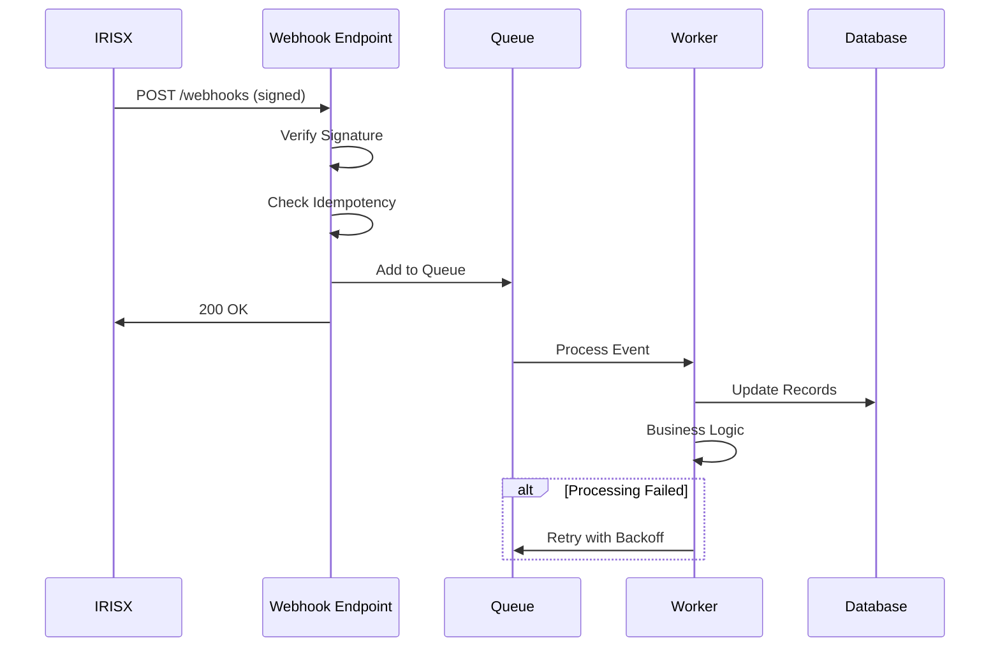

## Overview

Webhooks enable real-time event notifications from IRISX to your application. Build robust webhook handlers that are secure, reliable, and production-ready.

<CardGroup cols={2}>
  <Card title="Setup" icon="plug" href="#webhook-setup">
    Configure and register webhooks
  </Card>
  <Card title="Security" icon="lock" href="#signature-verification">
    Verify webhook authenticity
  </Card>
  <Card title="Reliability" icon="rotate" href="#error-handling">
    Handle failures and retries
  </Card>
  <Card title="Testing" icon="flask" href="#testing-webhooks">
    Test webhook implementations
  </Card>
</CardGroup>

## Webhook Setup

### Creating Webhook Endpoints

Register webhook URLs to receive events:

```javascript
const axios = require('axios');

const apiKey = 'your_api_key_here';
const apiUrl = 'https://api.useiris.com';

async function createWebhook(url, events) {
  const response = await axios.post(
    `${apiUrl}/v1/webhooks`,
    {
      url: url,
      events: events,
      secret: generateWebhookSecret(),
      active: true
    },
    {
      headers: {
        'X-API-Key': apiKey,
        'Content-Type': 'application/json'
      }
    }
  );

  console.log('Webhook created:', response.data.webhook.id);
  console.log('Secret:', response.data.webhook.secret);

  return response.data.webhook;
}

function generateWebhookSecret() {
  return require('crypto').randomBytes(32).toString('hex');
}

// Register webhook for call events
await createWebhook('https://yourapp.com/webhooks/calls', [
  'call.initiated',
  'call.ringing',
  'call.answered',
  'call.completed',
  'call.failed'
]);

// Register webhook for SMS events
await createWebhook('https://yourapp.com/webhooks/sms', [
  'sms.sent',
  'sms.delivered',
  'sms.failed',
  'sms.received'
]);
```

### Available Events

<AccordionGroup>
  <Accordion title="Call Events">
    - `call.initiated` - Call has been initiated
    - `call.ringing` - Phone is ringing
    - `call.answered` - Call has been answered
    - `call.completed` - Call has ended successfully
    - `call.failed` - Call failed to connect
    - `call.no-answer` - Call was not answered
    - `call.busy` - Recipient line was busy
  </Accordion>

  <Accordion title="SMS Events">
    - `sms.queued` - Message queued for sending
    - `sms.sent` - Message sent to carrier
    - `sms.delivered` - Message delivered to recipient
    - `sms.failed` - Message delivery failed
    - `sms.received` - Inbound SMS received
  </Accordion>

  <Accordion title="Recording Events">
    - `recording.started` - Recording has started
    - `recording.completed` - Recording is ready
    - `recording.failed` - Recording failed
    - `transcription.completed` - Transcription is ready
    - `transcription.failed` - Transcription failed
  </Accordion>

  <Accordion title="Voicemail Events">
    - `voicemail.received` - New voicemail received
    - `voicemail.transcribed` - Voicemail transcribed
  </Accordion>
</AccordionGroup>

## Basic Webhook Handler

### Express.js Implementation

```javascript
const express = require('express');
const crypto = require('crypto');
const app = express();

// Raw body parser for signature verification
app.use(express.json({
  verify: (req, res, buf) => {
    req.rawBody = buf.toString('utf8');
  }
}));

app.post('/webhooks/calls', async (req, res) => {
  try {
    // Verify signature
    if (!verifySignature(req)) {
      console.error('Invalid signature');
      return res.status(401).json({ error: 'Invalid signature' });
    }

    const event = req.body;

    console.log('Event received:', event.event);
    console.log('Data:', event.data);

    // Handle event
    await handleCallEvent(event);

    // Respond quickly (within 3 seconds)
    res.status(200).send('OK');
  } catch (error) {
    console.error('Webhook error:', error);
    res.status(500).json({ error: 'Internal server error' });
  }
});

async function handleCallEvent(event) {
  switch (event.event) {
    case 'call.initiated':
      console.log('Call initiated:', event.data.uuid);
      await updateCallStatus(event.data.uuid, 'initiated');
      break;

    case 'call.answered':
      console.log('Call answered:', event.data.uuid);
      await updateCallStatus(event.data.uuid, 'answered');
      await startTimer(event.data.uuid);
      break;

    case 'call.completed':
      console.log('Call completed:', event.data.uuid);
      console.log('Duration:', event.data.duration, 'seconds');
      console.log('Cost:', event.data.cost);
      await updateCallStatus(event.data.uuid, 'completed');
      await recordCallMetrics(event.data);
      break;

    case 'call.failed':
      console.error('Call failed:', event.data.uuid);
      console.error('Reason:', event.data.error);
      await updateCallStatus(event.data.uuid, 'failed');
      await notifyFailure(event.data);
      break;
  }
}

app.listen(3000, () => {
  console.log('Webhook server running on port 3000');
});
```

## Signature Verification

Verify webhook authenticity to prevent spoofing.

### Implementing Verification

```javascript
function verifySignature(req) {
  const signature = req.headers['x-irisx-signature'];
  const timestamp = req.headers['x-irisx-timestamp'];
  const webhookSecret = process.env.WEBHOOK_SECRET;

  if (!signature || !timestamp) {
    return false;
  }

  // Check timestamp to prevent replay attacks (5-minute window)
  const now = Math.floor(Date.now() / 1000);
  if (Math.abs(now - parseInt(timestamp)) > 300) {
    console.error('Timestamp too old');
    return false;
  }

  // Compute expected signature
  const payload = `${timestamp}.${req.rawBody}`;
  const expectedSignature = crypto
    .createHmac('sha256', webhookSecret)
    .update(payload)
    .digest('hex');

  // Compare signatures (timing-safe)
  return crypto.timingSafeEqual(
    Buffer.from(signature),
    Buffer.from(expectedSignature)
  );
}
```

### Complete Security Middleware

```javascript
function webhookSecurityMiddleware(secret) {
  return (req, res, next) => {
    const signature = req.headers['x-irisx-signature'];
    const timestamp = req.headers['x-irisx-timestamp'];

    if (!signature || !timestamp) {
      return res.status(401).json({ error: 'Missing security headers' });
    }

    // Verify timestamp
    const now = Math.floor(Date.now() / 1000);
    const requestTime = parseInt(timestamp);

    if (isNaN(requestTime)) {
      return res.status(401).json({ error: 'Invalid timestamp' });
    }

    if (Math.abs(now - requestTime) > 300) {
      return res.status(401).json({ error: 'Request too old' });
    }

    // Verify signature
    const payload = `${timestamp}.${req.rawBody}`;
    const expectedSignature = crypto
      .createHmac('sha256', secret)
      .update(payload)
      .digest('hex');

    try {
      const isValid = crypto.timingSafeEqual(
        Buffer.from(signature),
        Buffer.from(expectedSignature)
      );

      if (!isValid) {
        return res.status(401).json({ error: 'Invalid signature' });
      }

      next();
    } catch (error) {
      return res.status(401).json({ error: 'Invalid signature format' });
    }
  };
}

// Use middleware
app.post('/webhooks/calls',
  webhookSecurityMiddleware(process.env.WEBHOOK_SECRET),
  async (req, res) => {
    await handleCallEvent(req.body);
    res.status(200).send('OK');
  }
);
```

## Idempotency

Handle duplicate webhook deliveries gracefully.

### Implementing Idempotency

```javascript
const processedEvents = new Set();

// In production, use Redis or database
const redis = require('redis');
const redisClient = redis.createClient();

async function isEventProcessed(eventId) {
  // Check if event was already processed
  const exists = await redisClient.get(`webhook:${eventId}`);
  return exists !== null;
}

async function markEventProcessed(eventId) {
  // Mark as processed with 24-hour TTL
  await redisClient.setex(`webhook:${eventId}`, 86400, '1');
}

app.post('/webhooks/calls', async (req, res) => {
  try {
    // Verify signature
    if (!verifySignature(req)) {
      return res.status(401).json({ error: 'Invalid signature' });
    }

    const event = req.body;
    const eventId = event.id;

    // Check if already processed
    if (await isEventProcessed(eventId)) {
      console.log('Event already processed:', eventId);
      return res.status(200).send('OK');
    }

    // Process event
    await handleCallEvent(event);

    // Mark as processed
    await markEventProcessed(eventId);

    res.status(200).send('OK');
  } catch (error) {
    console.error('Webhook error:', error);
    res.status(500).json({ error: 'Internal server error' });
  }
});
```

## Error Handling

Implement robust error handling and retry logic.

### Graceful Error Handling

```javascript
async function handleWebhookWithRetry(event, maxRetries = 3) {
  let attempts = 0;

  while (attempts < maxRetries) {
    try {
      await processEvent(event);
      return { success: true };
    } catch (error) {
      attempts++;
      console.error(`Attempt ${attempts} failed:`, error.message);

      if (attempts >= maxRetries) {
        // Log to error tracking service
        await logFailedWebhook(event, error);
        throw error;
      }

      // Exponential backoff
      const delay = Math.min(1000 * Math.pow(2, attempts), 10000);
      await new Promise(resolve => setTimeout(resolve, delay));
    }
  }
}

app.post('/webhooks/calls', async (req, res) => {
  try {
    if (!verifySignature(req)) {
      return res.status(401).json({ error: 'Invalid signature' });
    }

    const event = req.body;

    // Respond immediately
    res.status(200).send('OK');

    // Process asynchronously
    setImmediate(async () => {
      try {
        await handleWebhookWithRetry(event);
      } catch (error) {
        console.error('Failed to process webhook:', error);
        // Event will be retried by IRISX
      }
    });
  } catch (error) {
    console.error('Webhook error:', error);
    res.status(500).json({ error: 'Internal server error' });
  }
});
```

### Dead Letter Queue

Store failed webhooks for manual processing:

```javascript
const AWS = require('aws-sdk');
const sqs = new AWS.SQS();

async function sendToDeadLetterQueue(event, error) {
  await sqs.sendMessage({
    QueueUrl: process.env.DLQ_URL,
    MessageBody: JSON.stringify({
      event: event,
      error: {
        message: error.message,
        stack: error.stack
      },
      timestamp: new Date().toISOString(),
      attempts: event.attempts || 0
    })
  }).promise();

  console.log('Event sent to DLQ:', event.id);
}

async function processEvent(event) {
  try {
    await handleCallEvent(event);
  } catch (error) {
    console.error('Processing failed:', error);

    // Increment attempt counter
    event.attempts = (event.attempts || 0) + 1;

    // Send to DLQ after max retries
    if (event.attempts >= 3) {
      await sendToDeadLetterQueue(event, error);
    }

    throw error;
  }
}
```

## Testing Webhooks

### Local Testing with ngrok

```bash
# Install ngrok
npm install -g ngrok

# Start your webhook server
node server.js

# In another terminal, start ngrok
ngrok http 3000

# Use the ngrok URL as your webhook URL
# Example: https://abc123.ngrok.io/webhooks/calls
```

### Manual Testing

```javascript
async function testWebhook(webhookUrl, event) {
  const timestamp = Math.floor(Date.now() / 1000);
  const payload = JSON.stringify(event);
  const signaturePayload = `${timestamp}.${payload}`;

  const signature = crypto
    .createHmac('sha256', process.env.WEBHOOK_SECRET)
    .update(signaturePayload)
    .digest('hex');

  const response = await axios.post(webhookUrl, event, {
    headers: {
      'Content-Type': 'application/json',
      'X-IRISX-Signature': signature,
      'X-IRISX-Timestamp': timestamp.toString()
    }
  });

  console.log('Response:', response.status, response.data);
}

// Test with sample event
const sampleEvent = {
  id: 'evt_123abc',
  event: 'call.completed',
  created_at: new Date().toISOString(),
  data: {
    uuid: '123e4567-e89b-12d3-a456-426614174000',
    to: '+15551234567',
    from: '+15559876543',
    status: 'completed',
    duration: 125,
    cost: 0.0175
  }
};

await testWebhook('http://localhost:3000/webhooks/calls', sampleEvent);
```

### Automated Testing

```javascript
const request = require('supertest');
const app = require('./server');

describe('Webhook Handlers', () => {
  const webhookSecret = 'test-secret';

  function signRequest(payload) {
    const timestamp = Math.floor(Date.now() / 1000);
    const signaturePayload = `${timestamp}.${JSON.stringify(payload)}`;
    const signature = crypto
      .createHmac('sha256', webhookSecret)
      .update(signaturePayload)
      .digest('hex');

    return { signature, timestamp };
  }

  test('should accept valid webhook', async () => {
    const event = {
      id: 'evt_test123',
      event: 'call.completed',
      data: { uuid: 'test-uuid', status: 'completed' }
    };

    const { signature, timestamp } = signRequest(event);

    const response = await request(app)
      .post('/webhooks/calls')
      .set('X-IRISX-Signature', signature)
      .set('X-IRISX-Timestamp', timestamp.toString())
      .send(event);

    expect(response.status).toBe(200);
  });

  test('should reject invalid signature', async () => {
    const event = { id: 'evt_test123', event: 'call.completed' };

    const response = await request(app)
      .post('/webhooks/calls')
      .set('X-IRISX-Signature', 'invalid-signature')
      .set('X-IRISX-Timestamp', Math.floor(Date.now() / 1000).toString())
      .send(event);

    expect(response.status).toBe(401);
  });

  test('should reject old timestamps', async () => {
    const event = { id: 'evt_test123', event: 'call.completed' };
    const oldTimestamp = Math.floor(Date.now() / 1000) - 400; // 6+ minutes old

    const signaturePayload = `${oldTimestamp}.${JSON.stringify(event)}`;
    const signature = crypto
      .createHmac('sha256', webhookSecret)
      .update(signaturePayload)
      .digest('hex');

    const response = await request(app)
      .post('/webhooks/calls')
      .set('X-IRISX-Signature', signature)
      .set('X-IRISX-Timestamp', oldTimestamp.toString())
      .send(event);

    expect(response.status).toBe(401);
  });
});
```

## Framework-Specific Examples

### Flask (Python)

```python
from flask import Flask, request, jsonify
import hmac
import hashlib
import time
import os

app = Flask(__name__)

WEBHOOK_SECRET = os.environ.get('WEBHOOK_SECRET')

def verify_signature(request):
    signature = request.headers.get('X-IRISX-Signature')
    timestamp = request.headers.get('X-IRISX-Timestamp')

    if not signature or not timestamp:
        return False

    # Check timestamp
    now = int(time.time())
    if abs(now - int(timestamp)) > 300:
        return False

    # Verify signature
    payload = f"{timestamp}.{request.get_data(as_text=True)}"
    expected_signature = hmac.new(
        WEBHOOK_SECRET.encode(),
        payload.encode(),
        hashlib.sha256
    ).hexdigest()

    return hmac.compare_digest(signature, expected_signature)

@app.route('/webhooks/calls', methods=['POST'])
def handle_call_webhook():
    if not verify_signature(request):
        return jsonify({'error': 'Invalid signature'}), 401

    event = request.get_json()

    # Handle event
    if event['event'] == 'call.completed':
        print(f"Call {event['data']['uuid']} completed")
        print(f"Duration: {event['data']['duration']} seconds")
        print(f"Cost: ${event['data']['cost']}")

    return 'OK', 200

if __name__ == '__main__':
    app.run(port=3000)
```

### PHP

```php
<?php

function verifySignature($request) {
    $signature = $_SERVER['HTTP_X_IRISX_SIGNATURE'] ?? '';
    $timestamp = $_SERVER['HTTP_X_IRISX_TIMESTAMP'] ?? '';
    $webhookSecret = getenv('WEBHOOK_SECRET');

    if (empty($signature) || empty($timestamp)) {
        return false;
    }

    // Check timestamp
    $now = time();
    if (abs($now - intval($timestamp)) > 300) {
        return false;
    }

    // Verify signature
    $payload = $timestamp . '.' . file_get_contents('php://input');
    $expectedSignature = hash_hmac('sha256', $payload, $webhookSecret);

    return hash_equals($signature, $expectedSignature);
}

// Webhook endpoint
if ($_SERVER['REQUEST_METHOD'] === 'POST') {
    if (!verifySignature($_REQUEST)) {
        http_response_code(401);
        echo json_encode(['error' => 'Invalid signature']);
        exit;
    }

    $event = json_decode(file_get_contents('php://input'), true);

    // Handle event
    switch ($event['event']) {
        case 'call.completed':
            error_log("Call {$event['data']['uuid']} completed");
            error_log("Duration: {$event['data']['duration']} seconds");
            break;

        case 'call.failed':
            error_log("Call {$event['data']['uuid']} failed");
            error_log("Error: {$event['data']['error']}");
            break;
    }

    http_response_code(200);
    echo 'OK';
}
```

## Production Best Practices

<AccordionGroup>
  <Accordion title="Security">
    - Always verify webhook signatures
    - Use HTTPS endpoints only
    - Implement rate limiting
    - Validate event data structure
    - Store secrets securely (environment variables)
    - Implement IP whitelisting if possible
    - Log all webhook attempts
  </Accordion>

  <Accordion title="Reliability">
    - Respond within 3 seconds
    - Process events asynchronously
    - Implement idempotency checks
    - Use message queues for processing
    - Implement retry logic with exponential backoff
    - Monitor webhook success rates
    - Set up dead letter queues
  </Accordion>

  <Accordion title="Performance">
    - Use connection pooling
    - Cache frequently accessed data
    - Batch database operations
    - Implement background job processing
    - Monitor memory usage
    - Scale horizontally as needed
    - Use CDN for webhook endpoints
  </Accordion>

  <Accordion title="Monitoring">
    - Log all webhook events
    - Track processing times
    - Monitor error rates
    - Set up alerting for failures
    - Use APM tools (New Relic, DataDog)
    - Track webhook delivery success
    - Review failed events regularly
  </Accordion>
</AccordionGroup>

## Webhook Flow Diagram



## Troubleshooting

<AccordionGroup>
  <Accordion title="Webhooks Not Received">
    - Verify webhook is active: `GET /v1/webhooks/:id`
    - Check endpoint is publicly accessible
    - Ensure HTTPS (not HTTP)
    - Review firewall rules
    - Check webhook logs in dashboard
    - Verify correct event types subscribed
  </Accordion>

  <Accordion title="Signature Verification Fails">
    - Check webhook secret matches
    - Verify timestamp is current
    - Ensure using raw body for signature
    - Check for extra whitespace in secret
    - Review signature computation logic
    - Test with known good signature
  </Accordion>

  <Accordion title="Timeout Errors">
    - Respond within 3 seconds
    - Process events asynchronously
    - Move heavy operations to queue
    - Reduce database queries
    - Optimize external API calls
    - Scale webhook endpoint
  </Accordion>

  <Accordion title="Duplicate Events">
    - Implement idempotency checks
    - Use event IDs for deduplication
    - Check Redis/cache for processed events
    - Review retry logic
    - Verify event processing is atomic
  </Accordion>
</AccordionGroup>

## Related Resources

<CardGroup cols={2}>
  <Card
    title="Webhook Concepts"
    icon="webhook"
    href="/concepts/webhooks"
  >
    Understanding webhook architecture
  </Card>
  <Card
    title="API Reference"
    icon="book"
    href="/api-reference/webhooks"
  >
    Complete webhooks API documentation
  </Card>
  <Card
    title="Error Handling"
    icon="triangle-exclamation"
    href="/guides/error-handling"
  >
    Handle errors and failures
  </Card>
  <Card
    title="Security Best Practices"
    icon="shield-check"
    href="/concepts/security"
  >
    Secure your integrations
  </Card>
</CardGroup>

## Next Steps

Build production-ready integrations:

- [Implement error handling](/guides/error-handling) for webhook failures
- [Set up monitoring](/guides/monitoring) for webhook performance
- [Learn about rate limiting](/concepts/rate-limiting) for API calls

Questions? Join our [Discord community](https://discord.gg/irisx) or email support@useiris.com.
