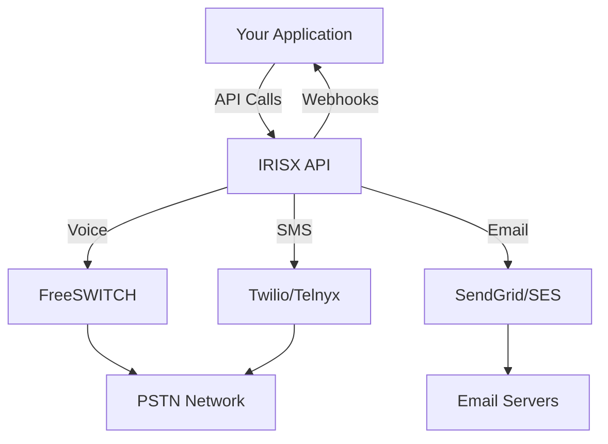

## What is IRISX?

IRISX is a powerful, developer-friendly communications platform that enables you to integrate voice calls, SMS, and email into your applications. Built for scale and reliability, IRISX provides enterprise-grade features at startup-friendly prices.

<CardGroup cols={2}>
  <Card
    title="Voice Calls"
    icon="phone"
    href="/concepts/calls"
  >
    Make and receive calls with advanced routing and IVR
  </Card>
  <Card
    title="SMS Messaging"
    icon="message"
    href="/concepts/sms"
  >
    Send SMS/MMS messages with delivery tracking
  </Card>
  <Card
    title="Email"
    icon="envelope"
    href="/concepts/email"
  >
    Send transactional and marketing emails
  </Card>
  <Card
    title="Webhooks"
    icon="webhook"
    href="/concepts/webhooks"
  >
    Real-time event notifications for your app
  </Card>
</CardGroup>

## Key Features

### 🚀 Multi-Channel Communication
- **Voice:** Outbound/inbound calls with FreeSWITCH
- **SMS:** Text messaging with Twilio/Telnyx integration
- **Email:** Transactional email via SendGrid/AWS SES

### 🎯 Smart Routing
- **LCR (Least Cost Routing):** Automatic carrier selection
- **Multi-carrier failover:** Built-in redundancy
- **Geographic routing:** Optimize by destination

### 📊 Real-Time Analytics
- **Call metrics:** Duration, cost, success rates
- **Delivery tracking:** SMS/Email status updates
- **Dashboard:** Beautiful visualizations

### 🔧 Developer Experience
- **RESTful API:** Clean, predictable endpoints
- **SDKs:** Node.js, Python, PHP, Ruby
- **Webhooks:** Real-time event notifications
- **OpenAPI spec:** Auto-generated documentation

### 🏢 Enterprise Ready
- **Multi-tenancy:** White-label ready
- **RBAC:** Role-based access control
- **Audit logs:** Complete activity tracking
- **99.9% uptime SLA**

## Use Cases

<AccordionGroup>
  <Accordion title="Customer Support">
    Build call centers with IVR, queuing, and agent routing. Track all customer interactions in one place.
  </Accordion>
  <Accordion title="Notifications">
    Send transactional SMS and email notifications for order updates, account alerts, and more.
  </Accordion>
  <Accordion title="Marketing">
    Run SMS and email campaigns with templates, scheduling, and analytics.
  </Accordion>
  <Accordion title="Two-Factor Authentication">
    Send SMS verification codes for account security and password resets.
  </Accordion>
</AccordionGroup>

## Architecture

## Quick Start

Get started in under 5 minutes:

<CardGroup cols={2}>
  <Card
    title="Quickstart Guide"
    icon="rocket"
    href="/quickstart"
  >
    Make your first API call
  </Card>
  <Card
    title="Authentication"
    icon="key"
    href="/authentication"
  >
    Learn about API keys and JWT
  </Card>
</CardGroup>

## Pricing

Simple, transparent pricing based on usage:

- **Voice:** $0.015/min (US)
- **SMS:** $0.0075/message (US)
- **Email:** $0.001/email
- **Phone Numbers:** $1/month (local)

<Note>
  **Beta Launch:** We're giving first 100 customers $100 in free credits!
</Note>

## Support

Need help? We're here for you:

- 📧 Email: support@useiris.com
- 💬 Discord: [Join our community](https://discord.gg/irisx)
- 📚 Docs: You're already here!
- 🐛 Issues: [GitHub](https://github.com/irisx/issues)

## Next Steps

<CardGroup cols={3}>
  <Card
    title="Quickstart"
    icon="bolt"
    href="/quickstart"
  >
    Make your first call
  </Card>
  <Card
    title="API Reference"
    icon="code"
    href="/api-reference"
  >
    Explore all endpoints
  </Card>
  <Card
    title="SDKs"
    icon="cube"
    href="/sdks"
  >
    Use our libraries
  </Card>
</CardGroup>
